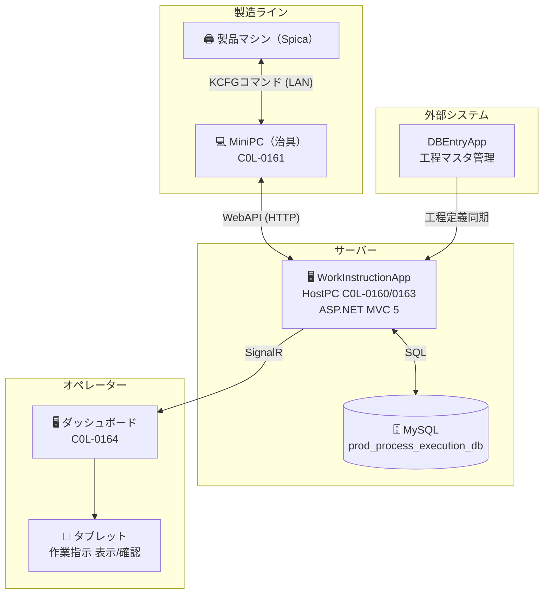

# Spica 保証工程 システム設計書

> **Spica（プリンター）の保証工程を管理するシステムの設計書・仕様書リポジトリ**  
> アプリ本体は [WorkInstructionApp](https://github.com/namagi14-lab/WorkInstructionApp) にあります。

---

## システム構成



---

## 保証工程の流れ

```
① IP採番（初工程のみ）
   オペレーターがシリアルをスキャン → サーバーがIPを採番 → MiniPCが製品にIP付与

② 入室
   MiniPC が /MachineApi/Enter を呼ぶ
   → process_execution（工程実行）を開始
   → 作業指示・ファイル実行レコードを PENDING で一括生成
   → ダッシュボードにリアルタイム反映（SignalR）

③ 工程Jsonファイル実行（StepOrder 順）
   MiniPC が /ProcessFileApi/Next を呼ぶ
   → ハッシュ確認（不一致なら /FileContent でダウンロード）
   → JSONファイルを製品マシンに実行

④ MANUAL Step でのオペレーター確認
   MiniPC が /StepApi/UpdateStep → hasInstruction=true の場合
   → オペレーターがタブレットで OK/NG を入力するまでポーリング待機

⑤ 工程完了
   全Stepが完了 → /MachineApi/Complete (OK/NG)
   → NG の場合はラインアウト → 修正後に再投入
```

各フローの詳細は **[07_system_design.md](docs/07_system_design.md)** の Mermaid シーケンス図を参照。

---

## ドキュメント一覧

| # | ファイル | 内容 |
|---|---------|------|
| 01 | [system_overview.md](docs/01_system_overview.md) | システム全体構成・概要 |
| 02 | [db_schema.md](docs/02_db_schema.md) | DB テーブル定義・設計方針 |
| 03 | [er_diagram.md](docs/03_er_diagram.md) | ER 図（Mermaid） |
| 04 | [api_spec.md](docs/04_api_spec.md) | MachineApi / StepApi / InstructionApi 仕様 |
| 05 | [sequence.md](docs/05_sequence.md) | 基本シーケンス図 |
| 06 | [process_file_api.md](docs/06_process_file_api.md) | 工程 Jsonファイル API 仕様（/ProcessFileApi） |
| 07 | [system_design.md](docs/07_system_design.md) | **システム設計書（Mermaid シーケンス 8本 + ER図）** |
| — | [SQL/schema.sql](SQL/schema.sql) | 完全 DDL（CREATE TABLE） |
| — | [docs/process_file_samples/](docs/process_file_samples/) | 工程 JSON サンプルファイル |

---

## DB テーブル早見表

### マスタ系

| テーブル | 役割 |
|---------|------|
| `process_master` | 工程マスタ（例: STA工程, COA工程） |
| `cells` | セル管理（1工程 = 1セル） |
| `zones` | ゾーン管理（セル内の物理ポジション） |
| `process_definition` | 工程定義 JSON（バージョン管理） |
| `work_instruction_master` | 作業指示マスタ（タブレット表示内容） |
| `process_file_sequence` | 工程 Jsonファイル順序・バージョン管理 |
| `users` | 作業者マスタ |
| `ip_numbering` | IP アドレス採番管理 |

### トランザクション系

| テーブル | 役割 |
|---------|------|
| `process_execution` | 工程実行レコード（1 マシン × 1 工程） |
| `process_step_execution` | Step ごとの実行結果 |
| `work_instruction_execution` | 作業指示の実行状態（PENDING/OK/NG/SKIPPED） |
| `process_file_execution` | MiniPC ファイル実行進捗（PENDING/RUNNING/OK/NG） |

---

## API 早見表

### MachineApi（MiniPC → HostPC）

| エンドポイント | 用途 |
|--------------|------|
| `POST /MachineApi/Enter` | 製品入室・工程開始 |
| `POST /MachineApi/Complete` | 工程完了（OK/NG） |
| `POST /MachineApi/Exit` | 異常退室・ABORT |

### StepApi（MiniPC → HostPC）

| エンドポイント | 用途 |
|--------------|------|
| `POST /StepApi/UpdateStep` | Step 開始通知・CurrentStepKey 更新 |
| `GET /StepApi/InstructionStatus` | オペレーター確認状態のポーリング |
| `POST /StepApi/RecordStep` | Step 完了を記録 |

### ProcessFileApi（MiniPC → HostPC）— 工程 Jsonファイル

| エンドポイント | 用途 |
|--------------|------|
| `GET /ProcessFileApi/Next?serialNo=` | 次に実行するファイルを問い合わせ |
| `GET /ProcessFileApi/FileContent/{seqId}` | ファイル内容を取得（ハッシュ不一致時） |

### InstructionApi（タブレット → HostPC）

| エンドポイント | 用途 |
|--------------|------|
| `POST /InstructionApi/Complete` | オペレーターが作業指示を OK/NG で完了 |

---

## DB 構築手順（新規環境）

```bash
# 1. ベーススキーマを実行
mysql -u root -p < SQL/schema.sql

# 2. 追加マイグレーションを順番に実行（WorkInstructionApp の SQL/ ディレクトリ参照）
mysql -u root -p prod_process_execution_db < 20260408_prod_db_integration.sql
mysql -u root -p prod_process_execution_db < 20260603_spica_schema_migration.sql
mysql -u root -p prod_process_execution_db < 20260603_process_file_tables.sql
```

---

## 工程 Jsonファイル バージョン管理

`process_file_sequence` テーブルで管理。同一ファイルの複数バージョンを保持し、`IsActive=1` が現在使用中。

```
ファイル更新時:
  旧レコード IsActive=0 → 新レコード INSERT (FileVersion+1, IsActive=1)

ロールバック時:
  管理画面の「履歴」→「有効化」ボタンで旧バージョンを再アクティブ化
```

管理画面: **WorkInstructionApp の マスタ → 工程 Jsonファイル**

---

## 関連リポジトリ

| リポジトリ | 役割 |
|-----------|------|
| [WorkInstructionApp](https://github.com/namagi14-lab/WorkInstructionApp) | HostPC アプリ本体（ASP.NET MVC 5） |
| [ProcessDashboard](https://github.com/namagi14-lab/ProcessDashboard) | ダッシュボード（SignalR リアルタイム表示） |
