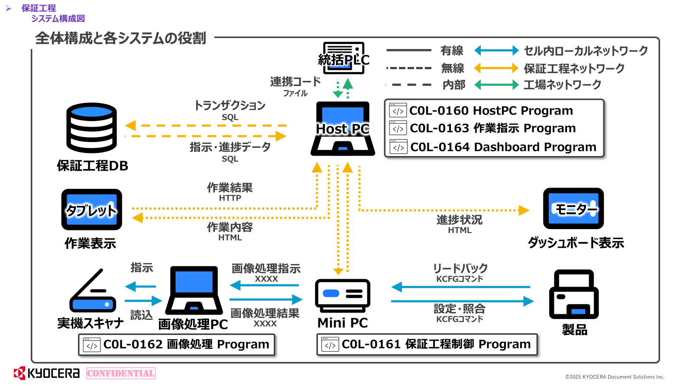

# 01 システム全体構成

## 1. 概要

Spica（プリンター）の組立後に行う**保証工程**のシステムです。
マシンに対してコマンドを送り、電気検査・仕向地設定・画像検査を行います。

---

## 2. システム構成図



---

## 3. 各システムの役割

### C0L-0160 / C0L-0163 WorkInstructionApp（HostPC Program / 作業指示Program）

- MiniPCからのAPIリクエストを受けてトランザクションを管理
- 作業指示コンテンツ（HTML）をタブレットに配信
- MySQLへのSQL発行（全トランザクション書き込み）
- SignalRでダッシュボードにリアルタイム更新をブロードキャスト

### C0L-0161 保証工程制御Program（MiniPC上）

- プリンター本体にKCFGコマンドを送信
- HostPCのAPIを呼び出してトランザクションを登録・更新
- 工程JSONに従ってステップを順次実行

### C0L-0162 画像処理Program（画像処理PC上）

- 実機スキャナを使った画像検査
- 検査結果をHostPCへ通知（仕様検討中）

### C0L-0164 Dashboard Program

- SignalRでHostPCからリアルタイム更新を受信
- セル・ゾーンごとの現在状態をモニター表示

---

## 4. 保証工程の構成

### ゾーン構成

| ゾーン | 内容 | ステップ種別 |
|--------|------|------------|
| Soft Install / 電気check | Softインストール・電気系統確認 | 自動 + 手動 |
| 画像検査 | 実機スキャナによる画像検査 | 自動 + 手動 |
| 出荷設定 (A1) | 仕向地設定（言語・紙サイズ・エリア等） | 自動 + 手動 |

### セル・ゾーン構造

```
CELL (cells テーブル)
  └─ ZONE × N  (zones テーブル)
        └─ 1台のプリンターが在席して工程を実行
```

- 1つのセルに複数ゾーンが存在
- ダッシュボード表示のためにゾーンはグリッド座標（GridRow/Col）を持つ

---

## 5. ステップ種別

| 種別 | 説明 | タブレット表示 |
|------|------|--------------|
| 自動 (AUTO) | MiniPCがプリンターにKCFGコマンドを送って完結 | なし |
| 手動 (MANUAL) | 作業者がタブレットで操作・確認 | タイトル＋テキスト＋画像＋フォーム |

- 自動/手動の区別は`process_definition.definition_json`内で定義
- 手動ステップのコンテンツは`work_instruction_master`で管理

---

## 6. 作業指示フォームの種類

| FormType | 表示ボタン | 用途 |
|----------|-----------|------|
| `OK_ONLY` | 「次へ」のみ | 確認・通知のみ |
| `OK_NG` | 「OK」「NG」 | 判定が必要な作業 |

---

## 7. IPアドレス管理

保証工程に入ってくるプリンターはすべて同一のデフォルトIPアドレスを持つため、
入庫時に固有IPを採番してマシンシリアルと紐づける。

```
前工程 → シリアル通知 → HostPC → 未使用IPを採番
                                  → ip_numbering に登録
                                  → MiniPCへIP設定指示
                                  → MiniPC → プリンターのIPを変更
```

---

## 8. NG時の再作業

NGになった場合は**新規の`process_execution`レコードを作成**して再実行する。  
元の実行IDを`retry_of_execution_id`に記録することで再作業の連鎖を追跡できる。

```
execution_id=10  retry_of=NULL  status=NG    ← 1回目
execution_id=25  retry_of=10    status=OK    ← 再作業
```
