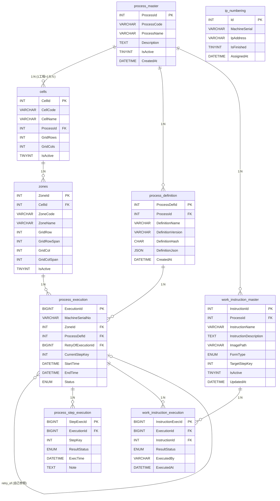

# 03 ER図

```mermaid
erDiagram

  process_master {
    INT ProcessId PK
    VARCHAR ProcessCode
    VARCHAR ProcessName
    TEXT Description
    TINYINT IsActive
    DATETIME CreatedAt
  }

  cells {
    INT CellId PK
    VARCHAR CellCode
    VARCHAR CellName
    INT ProcessId FK
    INT GridRows
    INT GridCols
    TINYINT IsActive
  }

  zones {
    INT ZoneId PK
    INT CellId FK
    VARCHAR ZoneCode
    VARCHAR ZoneName
    INT GridRow
    INT GridRowSpan
    INT GridCol
    INT GridColSpan
    TINYINT IsActive
  }

  process_definition {
    INT ProcessDefId PK
    INT ProcessId FK
    VARCHAR DefinitionName
    VARCHAR DefinitionVersion
    CHAR DefinitionHash
    JSON DefinitionJson
    DATETIME CreatedAt
  }

  work_instruction_master {
    INT InstructionId PK
    INT ProcessId FK
    VARCHAR InstructionName
    TEXT InstructionDescription
    VARCHAR ImagePath
    ENUM FormType
    INT TargetStepKey
    TINYINT IsActive
    DATETIME UpdatedAt
  }

  process_execution {
    BIGINT ExecutionId PK
    VARCHAR MachineSerialNo
    INT ZoneId FK
    INT ProcessDefId FK
    BIGINT RetryOfExecutionId FK
    INT CurrentStepKey
    DATETIME StartTime
    DATETIME EndTime
    ENUM Status
  }

  process_step_execution {
    BIGINT StepExecId PK
    BIGINT ExecutionId FK
    INT StepKey
    ENUM ResultStatus
    DATETIME ExecTime
    TEXT Note
  }

  work_instruction_execution {
    BIGINT InstructionExecId PK
    BIGINT ExecutionId FK
    INT InstructionId FK
    ENUM ResultStatus
    VARCHAR ExecutedBy
    DATETIME ExecutedAt
  }

  ip_numbering {
    INT Id PK
    VARCHAR MachineSerial
    VARCHAR IpAddress
    TINYINT IsFinished
    DATETIME AssignedAt
  }

  process_master        ||--o{ cells                      : "1:N (1工程=1セル)"
  process_master        ||--o{ process_definition         : "1:N"
  process_master        ||--o{ work_instruction_master    : "1:N"
  cells                 ||--o{ zones                      : "1:N"
  process_definition    ||--o{ process_execution          : "1:N"
  zones                 ||--o{ process_execution          : "1:N"
  process_execution     }o--o| process_execution          : "retry_of (自己参照)"
  process_execution     ||--o{ process_step_execution     : "1:N"
  process_execution     ||--o{ work_instruction_execution : "1:N"
  work_instruction_master ||--o{ work_instruction_execution : "1:N"
```
