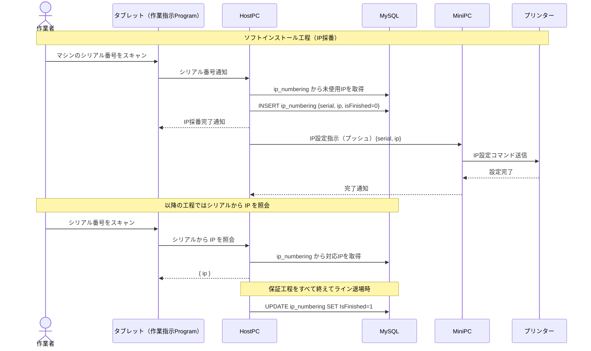
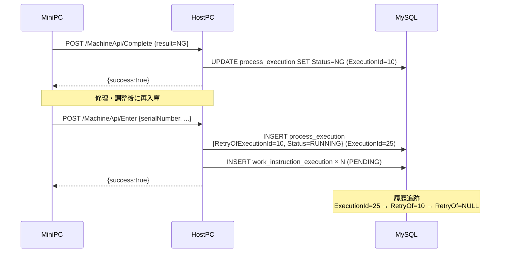
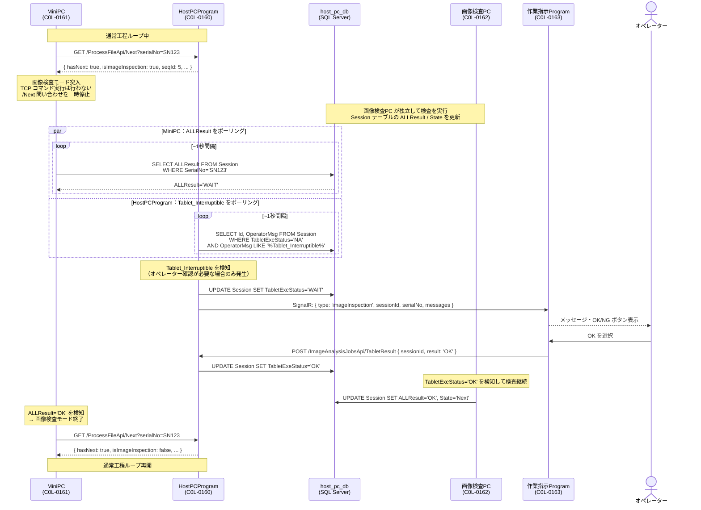
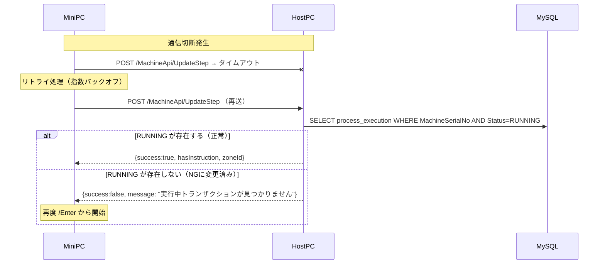

# 05 シーケンス図

> ⚠️ 本書は旧アーキテクチャ（HostPCProgram / `prod_process_execution_db` 中心）のシーケンスです。
> 現行方針では MiniPC は **HostPcアプリ（CarrotRape）** 経由で連携し DB へ直接アクセスしません。最新方針: **[12_host_pc_app_pivot.md](12_host_pc_app_pivot.md)**。

---

## 1. 工程実行の全体フロー（正常系）

---

## 2. IPアドレス採番フロー

---

## 3. NG→再作業フロー

---

## 4. 画像検査工程ハンドオフ

通常工程は MiniPC → HostPCProgram の `/ProcessFileApi/Next` 問い合わせで進むが、  
**画像検査工程に入ると MiniPC は HostPCProgram への問い合わせを一時停止し、`host_pc_db` を直接監視する。**

> オペレーター確認（`Tablet_Interruptible`）は画像検査の途中で複数回発生することがある。  
> MiniPC は ALLResult の変化のみを見ており、タブレット連携は HostPCProgram が透過的に処理する。

---

## 5. 異常系：通信切断・再接続

