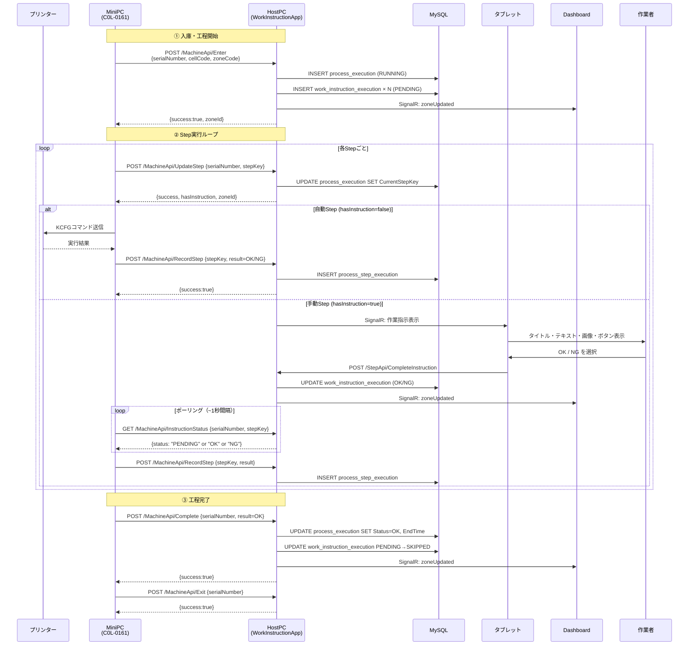
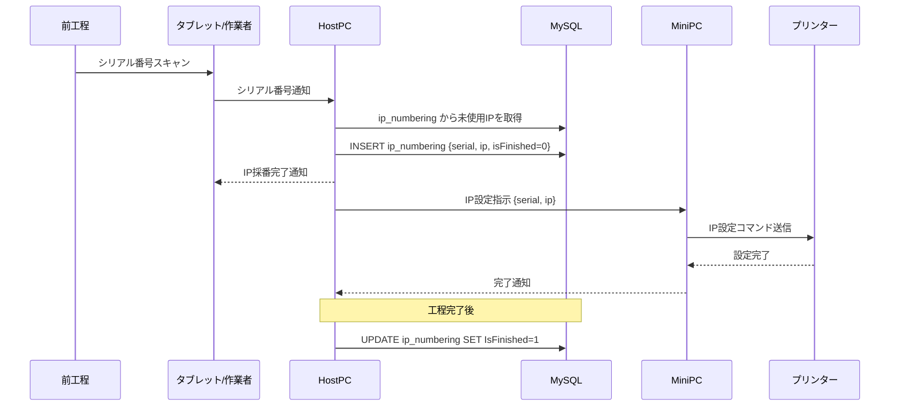
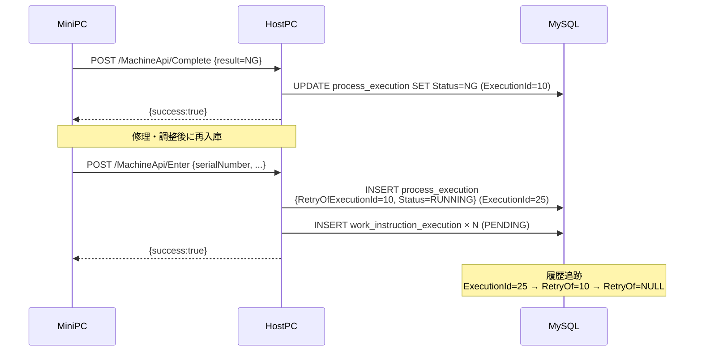
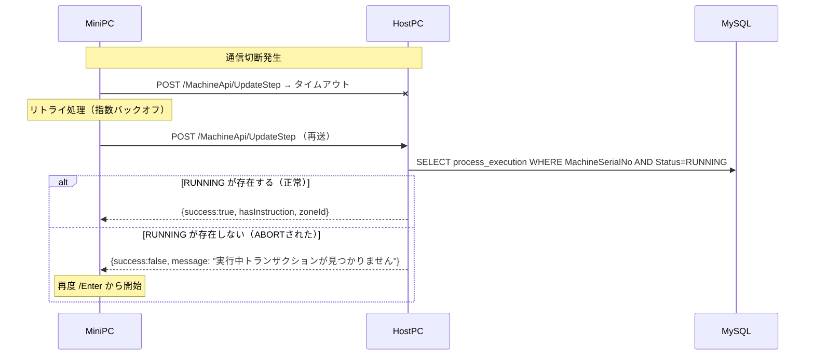

# 05 シーケンス図

---

## 1. 工程実行の全体フロー（正常系）

```mermaid
sequenceDiagram
  participant P  as プリンター
  participant M  as MiniPC<br>(C0L-0161)
  participant H  as HostPC<br>(WorkInstructionApp)
  participant DB as MySQL
  participant T  as タブレット
  participant D  as Dashboard

  Note over M,H: ① 入庫・工程開始

  M->>H: POST /MachineApi/Enter<br>{serialNumber, cellCode, zoneCode}
  H->>DB: INSERT process_execution (RUNNING)
  H->>DB: INSERT work_instruction_execution × N (PENDING)
  H->>D: SignalR: zoneUpdated
  H-->>M: {success:true, zoneId}

  Note over M,H: ② Step実行ループ

  loop 各Stepごと
    M->>H: POST /MachineApi/UpdateStep {serialNumber, stepKey}
    H->>DB: UPDATE process_execution SET CurrentStepKey
    H-->>M: {success, hasInstruction, zoneId}

    alt 自動Step (hasInstruction=false)
      M->>P: KCFGコマンド送信
      P-->>M: 実行結果
      M->>H: POST /MachineApi/RecordStep {stepKey, result=OK/NG}
      H->>DB: INSERT process_step_execution
      H-->>M: {success:true}

    else 手動Step (hasInstruction=true)
      H->>T: SignalR: 作業指示表示
      T->>作業者: タイトル・テキスト・画像・ボタン表示
      作業者->>T: OK / NG を選択
      T->>H: POST /StepApi/CompleteInstruction
      H->>DB: UPDATE work_instruction_execution (OK/NG)
      H->>D: SignalR: zoneUpdated

      loop ポーリング（~1秒間隔）
        M->>H: GET /MachineApi/InstructionStatus {serialNumber, stepKey}
        H-->>M: {status: "PENDING" or "OK" or "NG"}
      end

      M->>H: POST /MachineApi/RecordStep {stepKey, result}
      H->>DB: INSERT process_step_execution
    end
  end

  Note over M,H: ③ 工程完了

  M->>H: POST /MachineApi/Complete {serialNumber, result=OK}
  H->>DB: UPDATE process_execution SET Status=OK, EndTime
  H->>DB: UPDATE work_instruction_execution PENDING→SKIPPED
  H->>D: SignalR: zoneUpdated
  H-->>M: {success:true}

  M->>H: POST /MachineApi/Exit {serialNumber}
  H-->>M: {success:true}
```

---

## 2. IPアドレス採番フロー

```mermaid
sequenceDiagram
  participant Pre as 前工程
  participant T   as タブレット/作業者
  participant H   as HostPC
  participant DB  as MySQL
  participant M   as MiniPC
  participant P   as プリンター

  Pre->>T: シリアル番号スキャン
  T->>H: シリアル番号通知
  H->>DB: ip_numbering から未使用IPを取得
  H->>DB: INSERT ip_numbering {serial, ip, isFinished=0}
  H-->>T: IP採番完了通知
  H->>M: IP設定指示 {serial, ip}
  M->>P: IP設定コマンド送信
  P-->>M: 設定完了
  M-->>H: 完了通知

  Note over H,DB: 工程完了後
  H->>DB: UPDATE ip_numbering SET IsFinished=1
```

---

## 3. NG→再作業フロー

```mermaid
sequenceDiagram
  participant M  as MiniPC
  participant H  as HostPC
  participant DB as MySQL

  M->>H: POST /MachineApi/Complete {result=NG}
  H->>DB: UPDATE process_execution SET Status=NG (ExecutionId=10)
  H-->>M: {success:true}

  Note over M,H: 修理・調整後に再入庫

  M->>H: POST /MachineApi/Enter {serialNumber, ...}
  H->>DB: INSERT process_execution<br>{RetryOfExecutionId=10, Status=RUNNING} (ExecutionId=25)
  H->>DB: INSERT work_instruction_execution × N (PENDING)
  H-->>M: {success:true}

  Note over DB: 履歴追跡<br>ExecutionId=25 → RetryOf=10 → RetryOf=NULL
```

---

## 4. 異常系：通信切断・再接続

```mermaid
sequenceDiagram
  participant M  as MiniPC
  participant H  as HostPC
  participant DB as MySQL

  Note over M,H: 通信切断発生

  M-xH: POST /MachineApi/UpdateStep → タイムアウト

  Note over M: リトライ処理（指数バックオフ）

  M->>H: POST /MachineApi/UpdateStep （再送）
  H->>DB: SELECT process_execution WHERE MachineSerialNo AND Status=RUNNING

  alt RUNNING が存在する（正常）
    H-->>M: {success:true, hasInstruction, zoneId}
  else RUNNING が存在しない（ABORTされた）
    H-->>M: {success:false, message: "実行中トランザクションが見つかりません"}
    Note over M: 再度 /Enter から開始
  end
```
