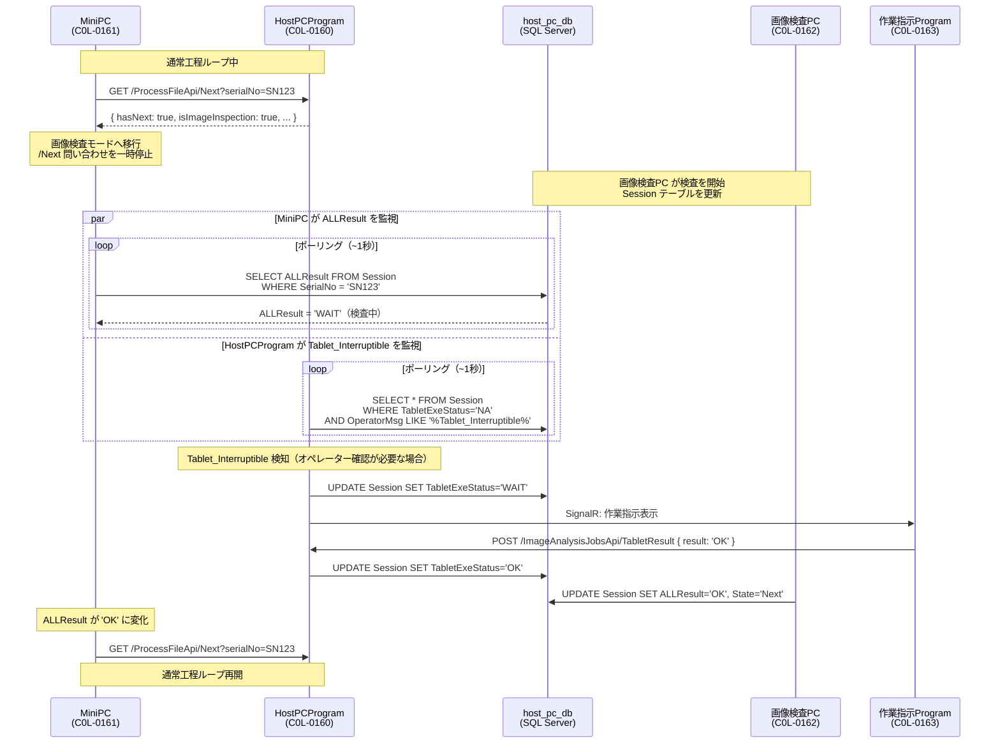

# 06 工程Jsonファイル API 仕様

> ⚠️ 本書は旧 HostPCProgram の `/ProcessFileApi` 仕様です。現行方針では工程JSON（治具JSON）の受け渡しは
> **HostPcアプリ（CarrotRape）** が担当します（`GET /api/Session/{id}/Next` 等）。最新方針: **[12_host_pc_app_pivot.md](12_host_pc_app_pivot.md)**。

MiniPC（治具）が HostPC に問い合わせて、次に実行すべき工程JSONファイルを取得するAPIです。

- **DB**: `prod_process_execution_db`
- **識別子**: MachineSerialNo（製品シリアル番号）
- **認証**: 不要（社内ネットワーク前提）

---

## フロー概要

```
MiniPC 起動
  │
  ▼
GET /ProcessFileApi/Next?serialNo=SN123
  │  ← サーバーは process_file_execution の進捗を見て返す
  ▼
{ hasNext: true, fileName: "...", fileHash: "sha256..." }
  │
  ├─ ローカルファイルの SHA-256 と一致 → そのまま実行
  │
  └─ 不一致 → GET /ProcessFileApi/FileContent/{seqId}
                 ← ファイル内容（JSON）を取得してローカルに保存・実行
  │
  ▼
再び GET /Next を呼び出す（前の RUNNING が OK になる）
  │
  ▼
hasNext: false になるまで繰り返す
```

---

## エンドポイント一覧

| Method | パス | 説明 |
|--------|------|------|
| GET | `/ProcessFileApi/Next` | 次に実行すべきファイルを問い合わせ |
| GET | `/ProcessFileApi/FileContent/{seqId}` | ファイル内容を取得（チェックサム不一致時） |

---

## GET /ProcessFileApi/Next

### 説明

- シリアルナンバーで実行中の `process_execution` を特定する
- 前回 RUNNING だったファイルを **OK** に更新する（前ファイルの完了扱い）
- 次の PENDING ファイルを **RUNNING** に更新して返す
- PENDING がなければ `hasNext: false` を返す

### クエリパラメータ

| パラメータ | 型 | 必須 | 説明 |
|-----------|-----|------|------|
| serialNo | string | ✓ | 製品シリアル番号 |

### レスポンス（次ファイルあり・通常工程）

```json
{
  "hasNext": true,
  "seqId": 2,
  "stepOrder": 2,
  "fileName": "Y_jsonStr_RegistrationSTA2_raspi.json",
  "fileHash": "a3f9b2c1d4e5f6a7b8c9d0e1f2a3b4c5d6e7f8a9b0c1d2e3f4a5b6c7d8e9f0a1",
  "fileVersion": 1,
  "isImageInspection": false
}
```

### レスポンス（次ファイルあり・画像検査工程）

```json
{
  "hasNext": true,
  "seqId": 5,
  "stepOrder": 5,
  "fileName": "Y_jsonStr_ImageInspectionSTA1_raspi.json",
  "fileHash": "b4c1d2e3f4a5b6c7d8e9f0a1b2c3d4e5f6a7b8c9d0e1f2a3b4c5d6e7f8a9b0c1",
  "fileVersion": 1,
  "isImageInspection": true
}
```

`isImageInspection: true` を受け取った MiniPC は通常の TCP コマンド実行を行わず、**画像検査モード**に移行する。詳細は「[画像検査ハンドオフフロー](#画像検査ハンドオフフロー)」を参照。

### レスポンス（全ファイル完了）

```json
{
  "hasNext": false
}
```

### レスポンス（エラー: 実行中トランザクションなし）

```json
{
  "hasNext": false,
  "error": "serialNo は必須です"
}
```

### 内部処理

1. `process_execution` から `MachineSerialNo = serialNo AND Status = 'RUNNING'` のレコードを取得
2. `process_file_execution` で `ExecutionId` に紐づく **RUNNING** レコードを `OK` に更新（`CompletedAt = NOW()`）
3. `process_file_execution` × `process_file_sequence` を JOIN して **PENDING** を `StepOrder ASC` で1件取得
4. 取得したレコードを **RUNNING** に更新（`StartedAt = NOW()`）
5. ファイル情報を返す

---

## GET /ProcessFileApi/FileContent/{seqId}

### 説明

指定した `SeqId` の工程JSONファイル内容を返す。  
MiniPC はチェックサムが一致しない場合にこのAPIを呼んでローカルファイルを更新する。

### パスパラメータ

| パラメータ | 型 | 必須 | 説明 |
|-----------|-----|------|------|
| seqId | int | ✓ | `process_file_sequence.SeqId` |

### レスポンス

Content-Type: `application/json`

```json
[
  {
    "Step_key": 1,
    "Command_Control": {
      "Com_type": "Get_ProgramVer",
      "Timeout": 3000,
      "Retry": 1
    }
  }
]
```

### エラー（404）

指定した SeqId が存在しない場合は HTTP 404 を返す。

---

## バージョン管理

`process_file_sequence` テーブルで同一ファイルの複数バージョンを管理する。

| SeqId | ProcessId | StepOrder | FileName | FileVersion | IsActive |
|-------|-----------|-----------|----------|-------------|----------|
| 1 | 1 | 1 | STA1.json | 1 | 0 |
| 2 | 1 | 1 | STA1.json | 2 | **1** ← 現在使用中 |
| 3 | 1 | 2 | STA2.json | 1 | **1** |

### 更新手順

1. 旧レコードを `IsActive = 0` に更新
2. 新バージョンを INSERT（`FileVersion` +1）
3. 新規 `process_execution` 開始時から新バージョンが適用される
4. 実行済み execution は過去の SeqId を保持するため履歴として残る

---

## 画像検査ハンドオフフロー

`isImageInspection: true` を受け取った MiniPC は、HostPCProgram への工程ファイル問い合わせを一時停止し、画像検査PC（C0L-0162）と `host_pc_db` を中心とした画像検査フローに移行する。

### MiniPC の挙動

```
GET /ProcessFileApi/Next → isImageInspection: true を受信
  │
  ▼
【画像検査モード突入】
  │  HostPCProgram への /Next 問い合わせを停止
  │  画像検査PC（C0L-0162）が host_pc_db を更新するのを待つ
  │
  ▼
host_pc_db.Session の ALLResult をポーリング（~1秒間隔）
  │  HostPCProgram も同時に Session をポーリングし、
  │  Tablet_Interruptible を検知したら作業指示Program へ SignalR 通知する
  │  （オペレーター確認が必要な場合のみ）
  │
  ├─ ALLResult = 'WAIT' → 継続監視
  │
  ├─ ALLResult = 'OK'  → 画像検査完了（正常）
  │                         HostPCProgram へ /Next 問い合わせ再開
  │
  └─ ALLResult = 'NG'  → 画像検査完了（異常）
                           エラー処理後 /Next または /Complete(NG) へ
```

### フロー図



### 画像検査中の責任分担

| 役割 | 担当 |
|------|------|
| 画像検査の実行・Session 更新 | 画像検査PC（C0L-0162） |
| `ALLResult` ポーリング（検査完了監視） | MiniPC（C0L-0161） |
| `Tablet_Interruptible` ポーリング・SignalR 通知 | HostPCProgram（C0L-0160） |
| オペレーター確認（OK/NG 入力） | 作業指示Program（C0L-0163）経由 |
| `TabletExeStatus` 更新 | HostPCProgram（C0L-0160） |

> **注意**: MiniPC は `Session.ALLResult` を監視するだけで、`Session` テーブルへの書き込みは行わない。`TabletExeStatus` の更新は HostPCProgram が担当する（[`10_image_inspection_api.md`](10_image_inspection_api.md) 参照）。

---

## 関連テーブル

| テーブル | 役割 |
|---------|------|
| `process_file_sequence` | ファイル順序・バージョン管理マスタ |
| `process_file_execution` | MiniPC の実行進捗（execution ごと）|
| `process_execution` | MiniPC の工程実行トランザクション |
| `process_master` | 工程マスタ |
| `host_pc_db.Session` | 画像検査フロー中の状態管理（画像検査モード時） |
