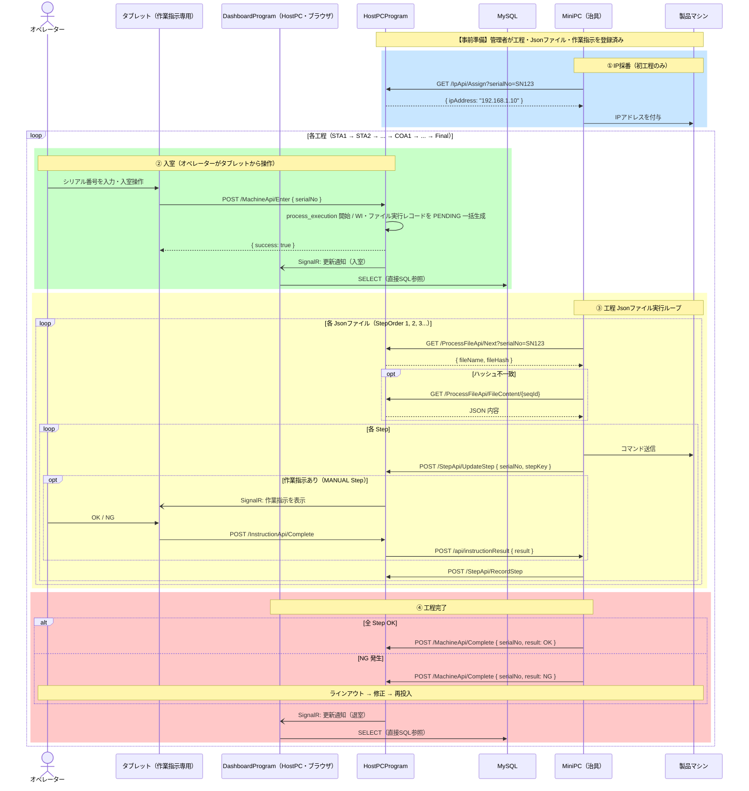
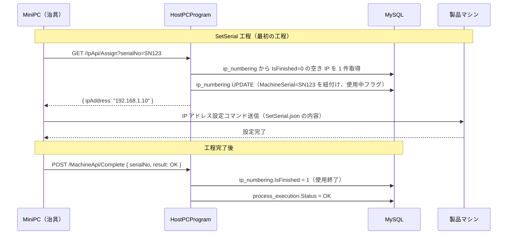
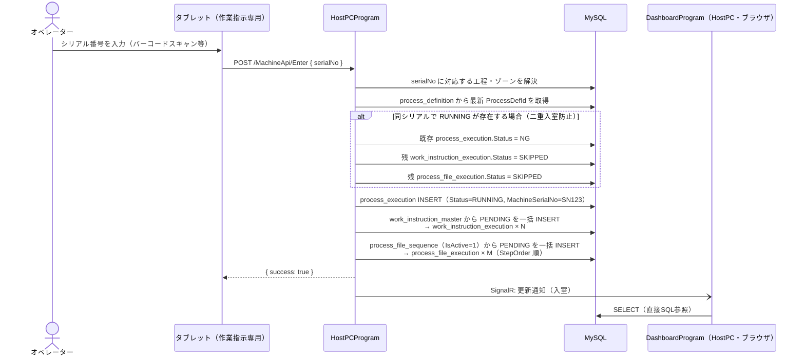
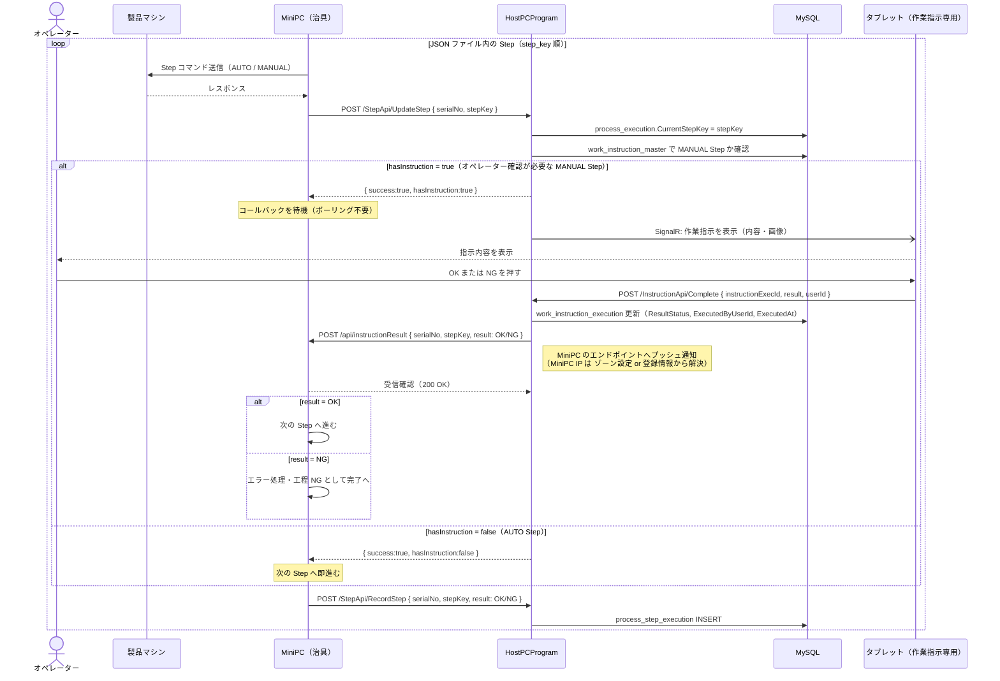
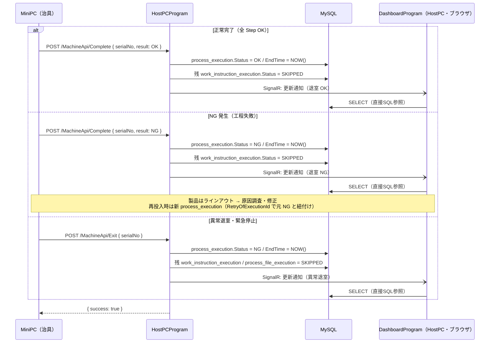
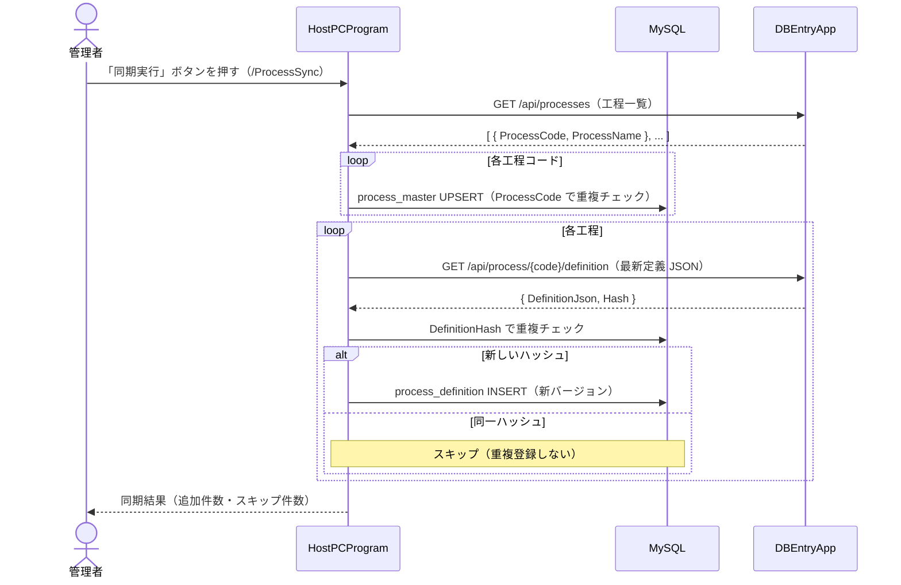
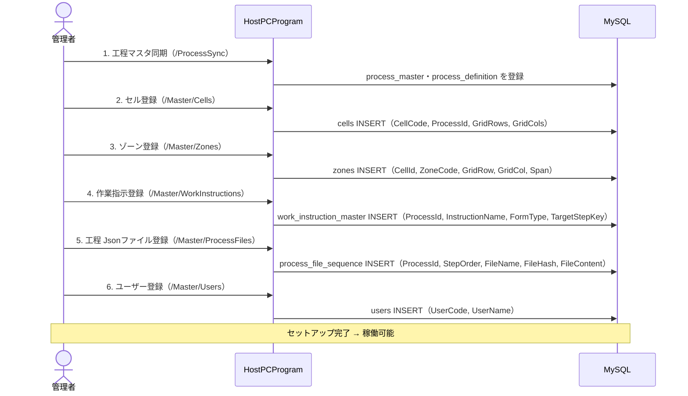
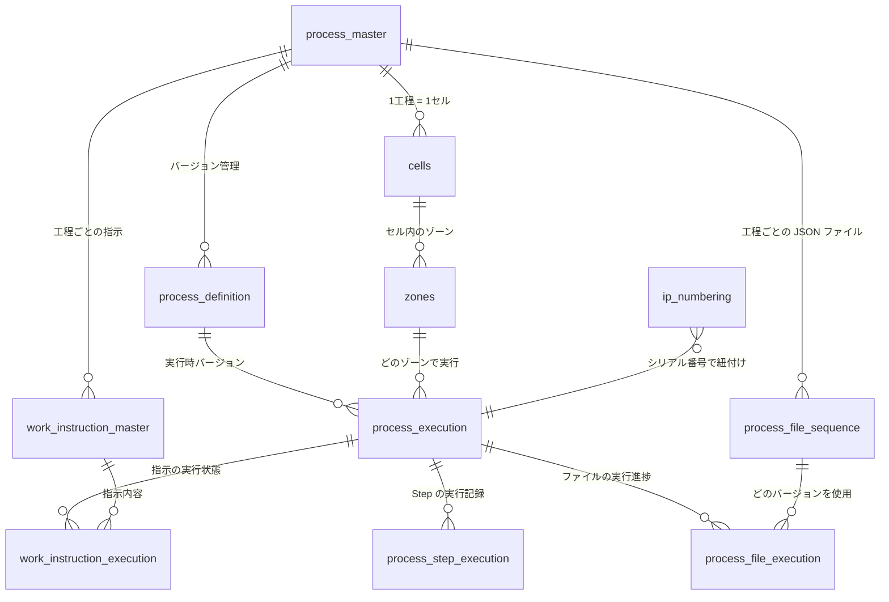
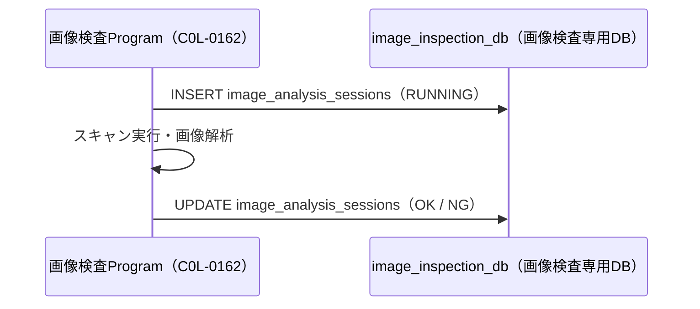
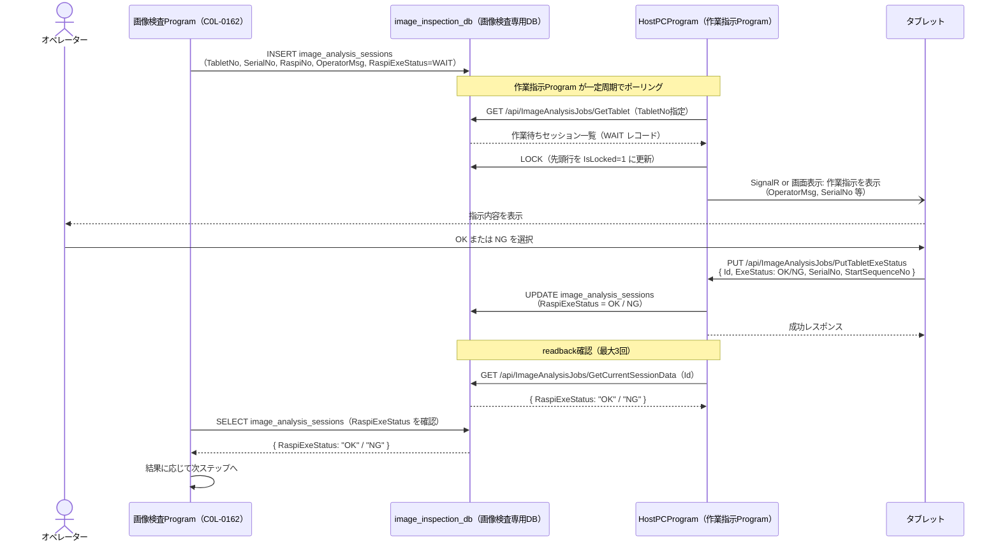

# Spica 保証工程 システム設計書

- **DB**: `prod_process_execution_db`（MySQL）
- **アプリ**: HostPCProgram（ASP.NET MVC 5 / IIS）

---

## 登場人物（アクター）

| アクター | 役割 |
|---------|------|
| 製品マシン | 保証対象の製品。MiniPC からコマンドを受け取る |
| MiniPC（ライン内） | 各ゾーンに設置。**保証工程制御Program（C0L-0161）**が動作。製品マシンを制御し、HostPCProgram と通信する。**HTTP サーバーも兼ねる（コールバック受信）** |
| HostPCProgram（HostPC） | **C0L-0160**。工程トランザクションを管理する Web アプリ（ASP.NET MVC 5）。MiniPC API・タブレット向け SignalR・DashboardProgram 向け通知を担う |
| タブレット（ライン内） | **作業指示Program（C0L-0163）**が動作。オペレーターが作業内容を確認し OK/NG を入力する |
| 画像検査PC（ライン内） | **画像検査Program（C0L-0162）**が動作。実機スキャナで画像検査を行い、`image_inspection_db` へ直接書き込む（暫定構成） |
| DashboardProgram（HostPC） | **C0L-0164**。HostPC 上で動作。SignalR で更新通知を受け取り、データは MySQL へ直接 SQL（SELECT のみ）で取得する。**表示はライン外のダッシュボード表示専用デバイスのブラウザで行う** |
| ダッシュボード表示デバイス（ライン外） | ブラウザで DashboardProgram にアクセスし、工程の進捗をモニター表示する専用デバイス |
| オペレーター | 作業者。タブレットで作業指示を確認し OK / NG を入力する |
| DBEntryApp | 外部システム。工程マスタ・工程定義 JSON を管理する |
| 管理者 | HostPCProgram の管理画面で各種マスタを設定する |

> **マシン特定の原則**: すべての処理でマシンを特定するキーは **シリアル番号** を使用する。

---

## 1. 全体概要フロー

製品が工程ラインを流れる全体像。

> **ダッシュボードのデータ取得方針**:  
> SignalR はデータを持たない「更新トリガー通知」のみに使用する。  
> データ本体はダッシュボードが MySQL へ直接 SQL（SELECT のみ）を発行して取得する。  
> INSERT / UPDATE は HostPCProgram のみが行い、ダッシュボードは書き込みを行わない。

---

## 2. IP 採番フロー（初工程のみ）

製品マシンが初めてラインに入るとき、サーバーの IP プールから空き IP を割り当てて MiniPC 経由で製品に付与する。

---

## 3. 入室〜工程開始フロー

**オペレーターがタブレットから**シリアル番号を入力して入室を登録する。

---

## 4. 工程 Jsonファイル取得フロー

MiniPC がサーバーに「次の JSON ファイル」を問い合わせ、必要ならダウンロードする。マシン特定はすべてシリアル番号で行う。

---

## 5. Step 実行〜作業指示フロー（プッシュ型）

MANUAL Step では MiniPC がサーバーに通知し、サーバーがタブレットへ表示・完了後に **MiniPC のエンドポイントへコールバック**する。MiniPC 側のポーリングは不要。

---

## 6. 工程完了・退室フロー

---

## 7. プロセス定義同期フロー（DBEntryApp → HostPCProgram）

---

## 8. 管理者セットアップフロー

---

## テーブル関連図（ER）

---

## 9. 画像検査工程フロー（暫定構成：専用DB経由）

> **この構成は暫定対応です。** 画像検査Program（C0L-0162）が現行のAPI連携に対応できないため、  
> `image_inspection_db`（HostPC上の専用DB）を仲介する構成を採用しています。  
> 将来的には通常の MiniPC → HostPCProgram API 構成に統一する予定です。

### 9-1. 画像検査での自動ステップ（作業指示なし）

---

### 9-2. 画像検査での手動ステップ（作業指示あり）

作業指示が必要なステップでは、画像検査Program が `image_inspection_db` に作業指示レコードを書き込む。  
HostPCProgram の作業指示Program（タブレットタブ）が DB をポーリングして検知し、タブレットに表示する。  
オペレーターが OK/NG を押すと、HostPCProgram が `image_inspection_db` を更新し、画像検査Program が結果を読み取る。

---

### 9-3. image_inspection_db の主要テーブル（概要）

`image_inspection_db` は画像検査Program が管理する専用DBです。  
HostPCProgram はこのDBに対して **読み取り・更新のみ** 行い、スキーマ管理は画像検査Program 側が行います。  
詳細は **[08_image_inspection_db.md](08_image_inspection_db.md)** を参照してください。

| テーブル | 主な用途 |
|---------|---------|
| `image_analysis_sessions` | 画像検査ジョブ・作業指示のセッション管理（WAIT/OK/NG） |

HostPCProgram が使用する主なカラム:

| カラム名 | 内容 |
|---------|------|
| `Id` | セッションID（LOCK/OK/NG操作のキー） |
| `TabletNo` | タブレット識別番号 |
| `SerialNo` | マシンシリアル番号 |
| `RaspiNo` | RaspiNo（基板識別） |
| `OperatorMsg` | タブレットに表示する作業指示文字列 |
| `SequenceNo` | シーケンス番号 |
| `StartSequenceNo` | 開始シーケンス番号 |
| `SequenceType` | シーケンス種別 |
| `MachineCode` | マシンコード |
| `RaspiExeStatus` | 実行状態（`WAIT` / `OK` / `NG`） |
| `IsLocked` | LOCK状態（0: 未LOCK, 1: LOCK中） |

---

### 9-4. HostPCProgram に追加する API エンドポイント（画像検査工程向け）

画像検査専用DB との仲介のため、HostPCProgram に以下のエンドポイントを追加します。

| エンドポイント | メソッド | 用途 |
|--------------|---------|------|
| `/api/ImageAnalysisJobs/GetCheck` | GET | 疎通確認（作業指示Program の PingCheck 用） |
| `/api/ImageAnalysisJobs/GetTablet` | GET | 作業待ちセッション一覧取得（TabletNo 指定） |
| `/api/ImageAnalysisJobs/LockById/{id}` | PUT | 先頭行を LOCK（IsLocked=1 に更新） |
| `/api/ImageAnalysisJobs/UnlockById/{id}` | PUT | LOCK 解除（IsLocked=0 に更新） |
| `/api/ImageAnalysisJobs/PutTabletExeStatus` | PUT | OK/NG 結果を反映（RaspiExeStatus 更新） |
| `/api/ImageAnalysisJobs/GetCurrentSessionData/{id}` | GET | readback 確認（RaspiExeStatus 取得） |
| `/api/ImageAnalysisJobs/GetTabletRelationList` | GET | StartSequenceNo 候補一覧取得 |
| `/api/ImageAnalysisJobs/DeclareMasterSlaveRelation` | PUT | RaspiNo ↔ SerialNo 関連宣言 |
| `/api/ImageAnalysisJobs/DeclareChartNoWithSNAndAreaName` | PUT | SerialNo + AreaNo から ChartNo 自動宣言 |
| `/api/ImageAnalysisJobs/DeclareChartNo` | PUT | 手動 ChartNo 宣言 |

---

## API 早見表

### タブレット → HostPCProgram（オペレーター操作）

| エンドポイント | 用途 |
|--------------|------|
| `POST /MachineApi/Enter` | **入室**（オペレーターがシリアル番号を入力） |
| `POST /InstructionApi/Complete` | 作業指示を OK/NG で完了 |

### MiniPC → HostPCProgram

| エンドポイント | 用途 |
|--------------|------|
| `GET /IpApi/Assign?serialNo=` | **IP 採番**（空き IP を割り当て） |
| `GET /ProcessFileApi/Next?serialNo=` | 次に実行する JSON ファイルを問い合わせ |
| `GET /ProcessFileApi/FileContent/{seqId}` | ファイル内容を取得（ハッシュ不一致時） |
| `POST /StepApi/UpdateStep` | Step 開始通知（MANUAL Step の確認トリガー） |
| `POST /StepApi/RecordStep` | Step 完了を記録 |
| `POST /MachineApi/Complete` | 工程完了（OK/NG） |
| `POST /MachineApi/Exit` | 異常退室 |

### HostPCProgram → MiniPC（コールバック・プッシュ型）

| エンドポイント | 用途 |
|--------------|------|
| `POST /api/instructionResult` | 作業指示の OK/NG をプッシュ通知 |

> MiniPC の IP は ゾーン設定またはMiniPC 起動時の登録情報から解決する。

### 作業指示Program → HostPCProgram（画像検査工程専用・暫定）

| エンドポイント | 用途 |
|--------------|------|
| `GET /api/ImageAnalysisJobs/GetCheck` | 疎通確認 |
| `GET /api/ImageAnalysisJobs/GetTablet` | 作業待ちセッション一覧取得 |
| `PUT /api/ImageAnalysisJobs/LockById/{id}` | LOCK |
| `PUT /api/ImageAnalysisJobs/UnlockById/{id}` | UNLOCK |
| `PUT /api/ImageAnalysisJobs/PutTabletExeStatus` | OK/NG 結果反映 |
| `GET /api/ImageAnalysisJobs/GetCurrentSessionData/{id}` | readback 確認 |
| `GET /api/ImageAnalysisJobs/GetTabletRelationList` | StartSequenceNo 候補取得 |
| `PUT /api/ImageAnalysisJobs/DeclareMasterSlaveRelation` | RaspiNo ↔ SerialNo 関連宣言 |
| `PUT /api/ImageAnalysisJobs/DeclareChartNoWithSNAndAreaName` | ChartNo 自動宣言 |
| `PUT /api/ImageAnalysisJobs/DeclareChartNo` | 手動 ChartNo 宣言 |
