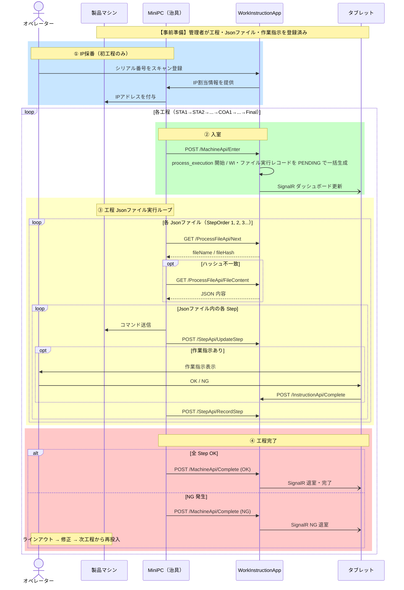
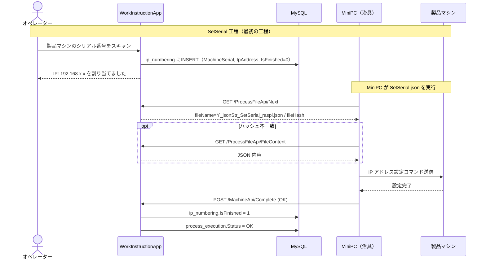
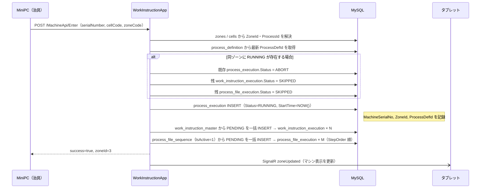
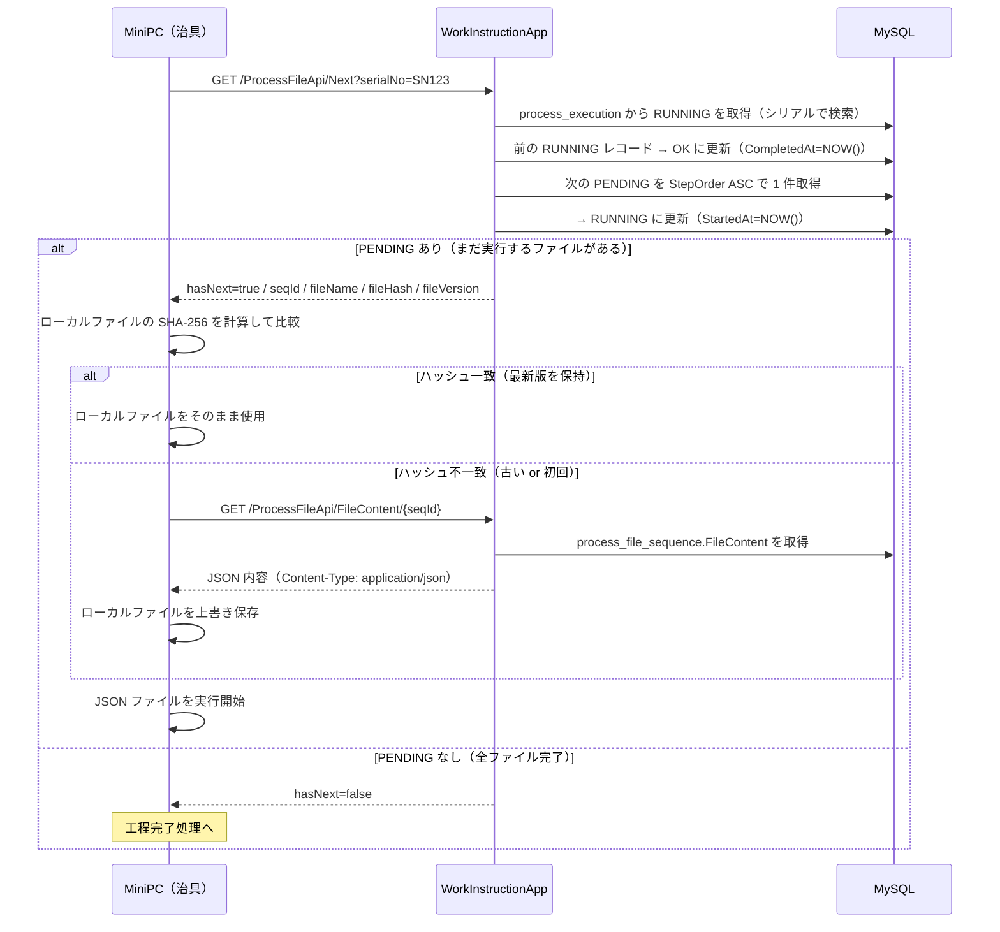
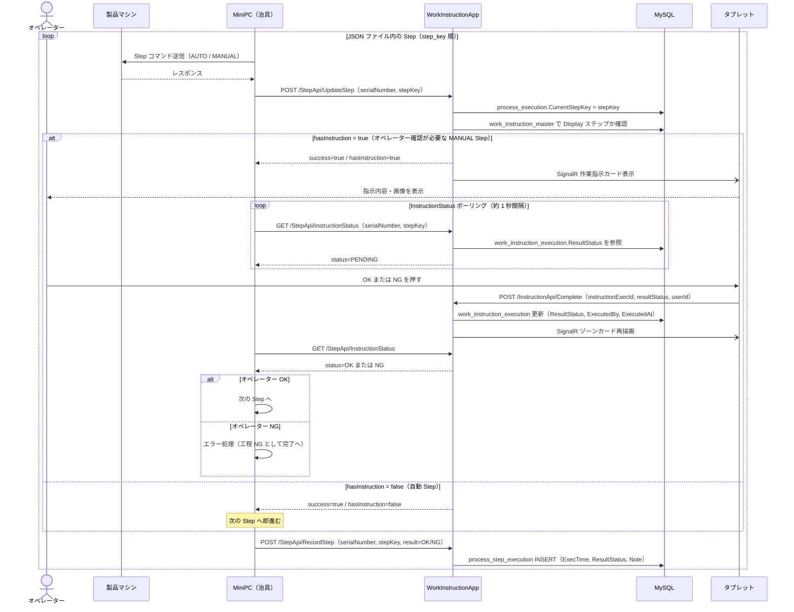
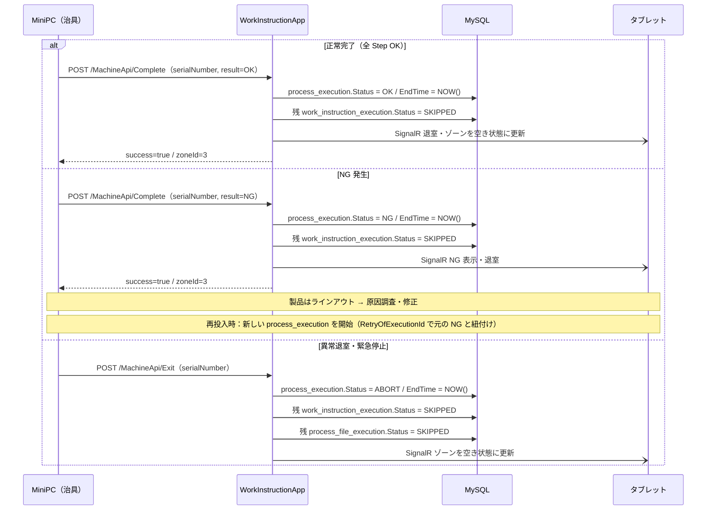
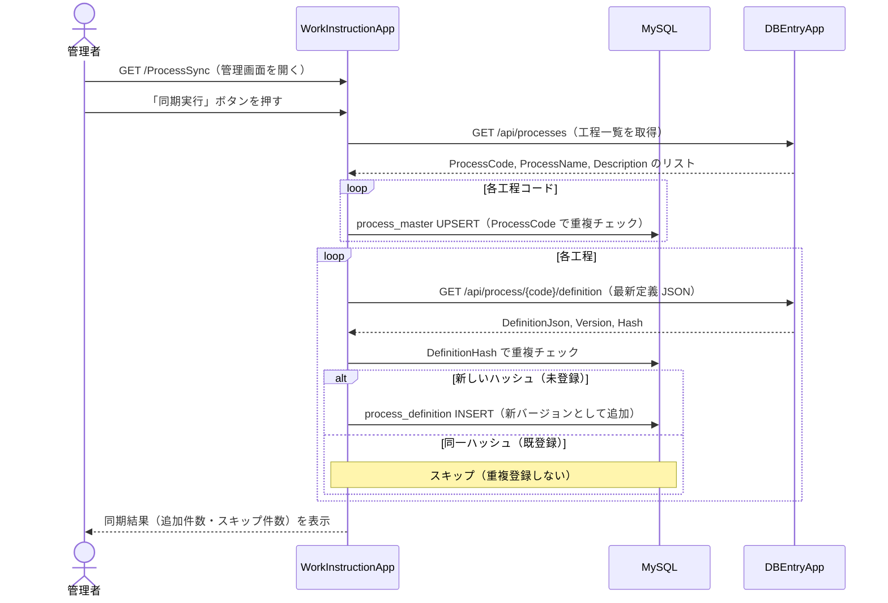
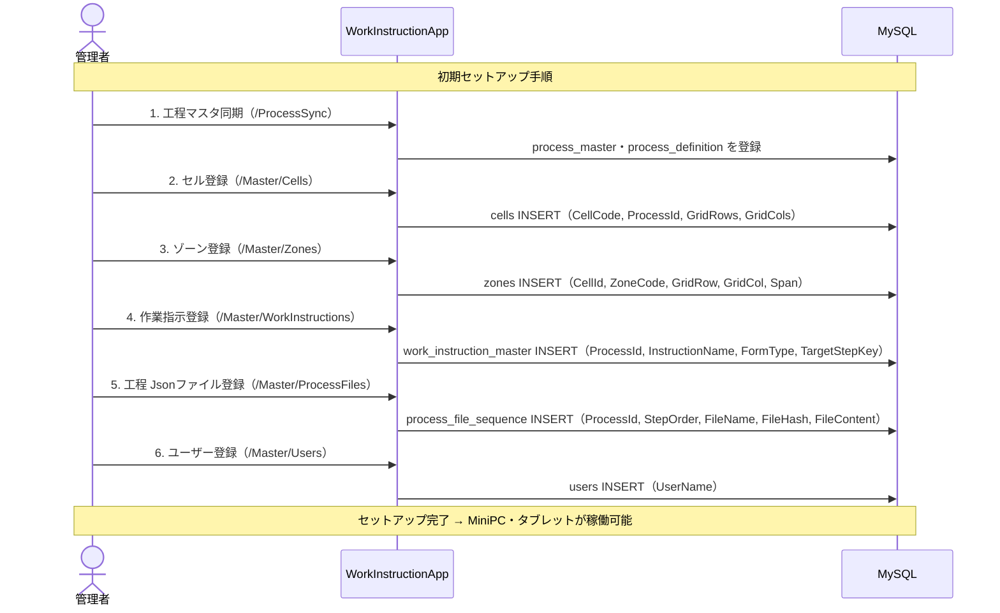
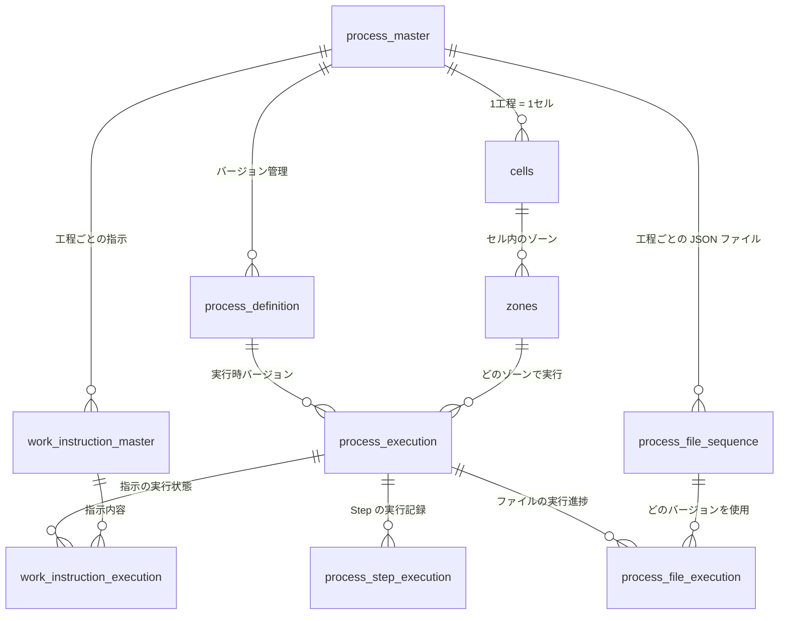

# Spica 保証工程 システム設計書

- **DB**: `prod_process_execution_db`（MySQL）
- **アプリ**: WorkInstructionApp（ASP.NET MVC 5 / IIS）

---

## 登場人物（アクター）

| アクター | 役割 |
|---------|------|
| 製品マシン | 保証対象の製品。工程ごとに MiniPC からコマンドを受け取る |
| MiniPC（治具） | 各ゾーンに設置。製品マシンへコマンドを送り、HostPC と通信する |
| WorkInstructionApp（HostPC） | 工程トランザクションを管理する Web アプリ。MySQL に記録する |
| タブレット | 各ゾーンに設置。オペレーターが作業指示を確認・応答する |
| オペレーター | 作業者。タブレットで作業指示を確認し OK / NG を入力する |
| DBEntryApp | 外部システム。工程マスタ・工程定義 JSON を管理する |
| 管理者 | WorkInstructionApp の管理画面で各種マスタを設定する |

---

## 1. 全体概要フロー

製品が工程ラインを流れる全体像をざっくりと示す。

---

## 2. IP 採番フロー（初工程のみ）

製品マシンが初めてラインに入るとき、IP アドレスを採番して付与する。

---

## 3. 入室〜工程開始フロー

MiniPC が製品マシンとともにゾーンに入室し、工程トランザクションを開始する。

---

## 4. 工程 Jsonファイル取得フロー

MiniPC がサーバーに「次の JSON ファイル」を問い合わせ、必要ならダウンロードする。

---

## 5. Step 実行〜作業指示確認フロー

JSON ファイル内の各 Step を実行し、MANUAL Step ではオペレーター確認を待つ。

---

## 6. 工程完了・退室フロー

工程が正常終了・NG・異常退室した場合の処理。

---

## 7. プロセス定義同期フロー（DBEntryApp → WorkInstructionApp）

管理者が手動でトリガーし、外部の DBEntryApp から工程マスタ・定義 JSON を取り込む。

---

## 8. 管理者セットアップフロー

初期構築・マスタ登録の手順。

---

## テーブル関連図（簡略 ER）

