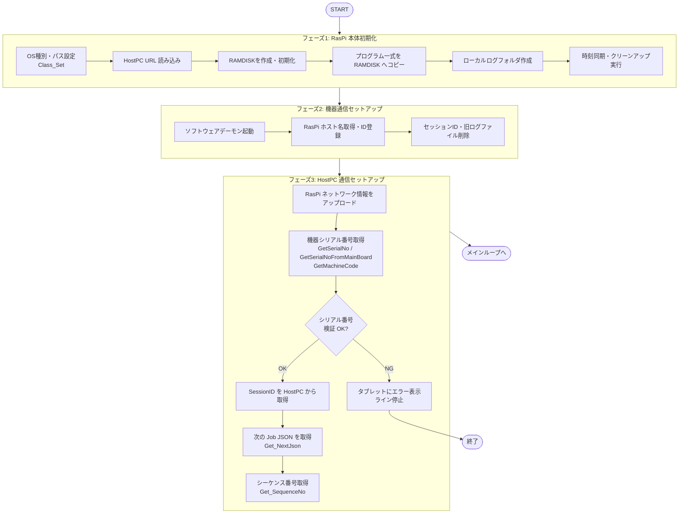
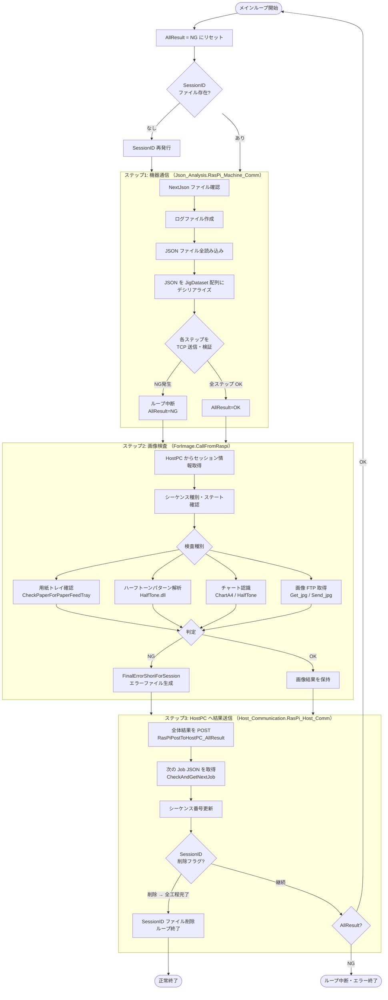
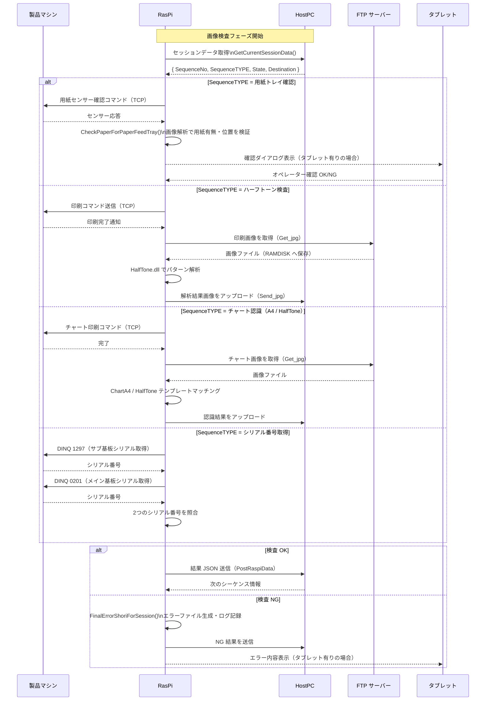
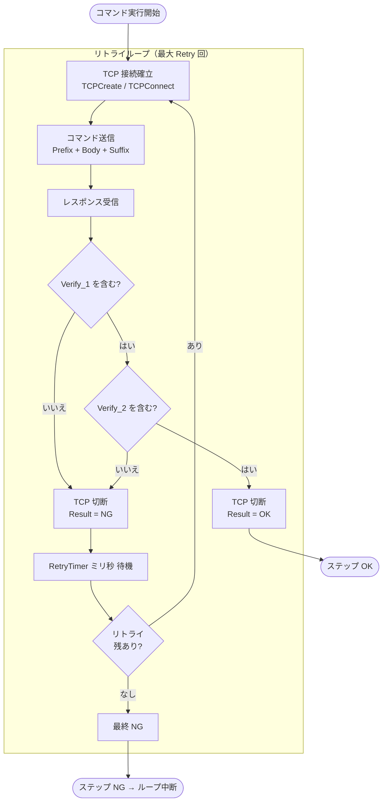

# 08 画像検査フロー（旧機種 RasPi 調査結果）

> **本ドキュメントの目的**  
> 旧機種で使用していた画像検査プログラム（`RasPi_Main` / C#）を調査し、Spica 向け作業指示 Program に同等機能を組み込む際の参考情報として整理する。

---

## 1. 旧機種システム構成

| コンポーネント | 旧機種（RasPi） | 新機種（Spica） |
|--------------|----------------|----------------|
| 制御ユニット   | Raspberry Pi | MiniPC（C0L-0161） |
| サーバー      | HostPC（WebAPI） | HostPCProgram |
| 機器通信      | TCP/IP | TCP/IP（同様） |
| 画像処理      | `ForImage.cs`（8,500行） | **未実装 → 今後の対象** |
| 外部ライブラリ | HalfTone.dll、HOST_Communication.dll | TBD |
| ストレージ    | RAMDISK（`/mnt/ramdisk/`）＋SSD | TBD |

---

## 2. 旧機種プログラム全体フロー

### 2.1 起動シーケンス（3フェーズ）



### 2.2 メインループ（3ステップを繰り返す）



---

## 3. 画像検査フロー詳細（`ForImage.CallFromRaspi`）



---

## 4. 画像検査種別一覧

| 種別 | コマンドタイプ | 概要 | 使用ライブラリ |
|------|-------------|------|-------------|
| 用紙トレイ確認 | `CheckPaper` | 給紙トレイの用紙有無・位置を画像で検証 | 内製ロジック |
| ハーフトーン検査 | `HalfTone` | 印刷物のハーフトーンパターンを解析 | `HalfTone.dll` |
| チャート認識 A4 | `ChartA4` | A4 チャートのテンプレートマッチング | `HalfTone.dll` |
| 画像取得 | `Get_jpg` | 機器の FTP サーバーから画像を取得 | 内製 FTP |
| 画像送信 | `Send_jpg` | 解析済み画像を HostPC へアップロード | 内製 FTP |
| シリアル取得 | `SNRE_type1/2` | 基板からシリアル番号を TCP で読み取り | TCP 通信 |

---

## 5. TCP コマンド実行フロー（各ステップ共通）



---

## 6. ファイル・データ構造

### 6.1 Job JSON（HostPC → RasPi）

HostPC から RAMDISK へ配信される工程定義。各ステップの送信コマンドと検証条件を含む。

```json
[
  {
    "Step_key": 1,
    "Command_Control": {
      "Com_type": "SendReceiveJudge",
      "Comment": "用紙センサー確認",
      "Verify_1": "OK",
      "Verify_2": "",
      "Retry": 3,
      "RetryTimer": 500
    },
    "Command_Body": {
      "Prefix": "CMD",
      "Body": "CHECK_PAPER",
      "Suffix": "\r\n"
    },
    "Command_return": {
      "Result": "",
      "Ref": "",
      "Excomment": ""
    }
  }
]
```

### 6.2 結果ログファイル（RasPi ローカル保存）

```
/home/pi/log/YYYYMMDD/
  └── {MachineSerial}_{Timestamp}_SeqNo.{N}_{OK|NG}.json
```

### 6.3 セッション管理

```
/home/pi/SessionID/SessionID.txt   … 現在の SessionID
/mnt/ramdisk/Athena_debug/NextJson/test.json … 次に実行する Job JSON
```

---

## 7. Spica 向け実装検討ポイント

旧機種 RasPi のフローを参考に、Spica（MiniPC）向けに移植する際の検討項目。

| 項目 | 旧機種（RasPi） | Spica 向け検討 |
|------|--------------|--------------|
| 画像処理ライブラリ | `HalfTone.dll`（独自） | 同 DLL を流用するか OpenCV 等に変更するか確認が必要 |
| 画像保存先 | RAMDISK（`/mnt/ramdisk/`） | Windows なら TEMP フォルダ等に変更 |
| FTP アクセス | 機器内蔵 FTP サーバーへ直接接続 | Spica でも機器 FTP が使えるか確認 |
| タブレット連携 | `ForImage.PutGetWaitTablet()` | SignalR（プッシュ型）に変更（`05_sequence.md` 参照） |
| シリアル取得 | TCP（DINQ コマンド） | Spica でも同コマンドが使えるか確認 |
| HostPC への画像送信 | `Send_jpg`（独自プロトコル） | HostPCProgram の API エンドポイントとして設計 |
| 工程スキップ機能 | `CheckProcessSkip`（再作業対応） | `RetryOfExecutionId` で代替可能か検討 |

---

## 8. 未確認事項（要調査）

- [ ] Spica 機種の画像検査種別・内容（用紙トレイ・ハーフトーン等は同じか？）
- [ ] `HalfTone.dll` が Spica の環境（Windows / .NET バージョン）で動作するか
- [ ] 機器内蔵 FTP サーバーの仕様（Spica でも同様か）
- [ ] 画像取得のタイミング（印刷完了通知の方法）
- [ ] 画像の HostPC 保存要件（DB 格納 or ファイルサーバー）
- [ ] 作業指示 Program での画像検査 Step の JSON 定義形式
