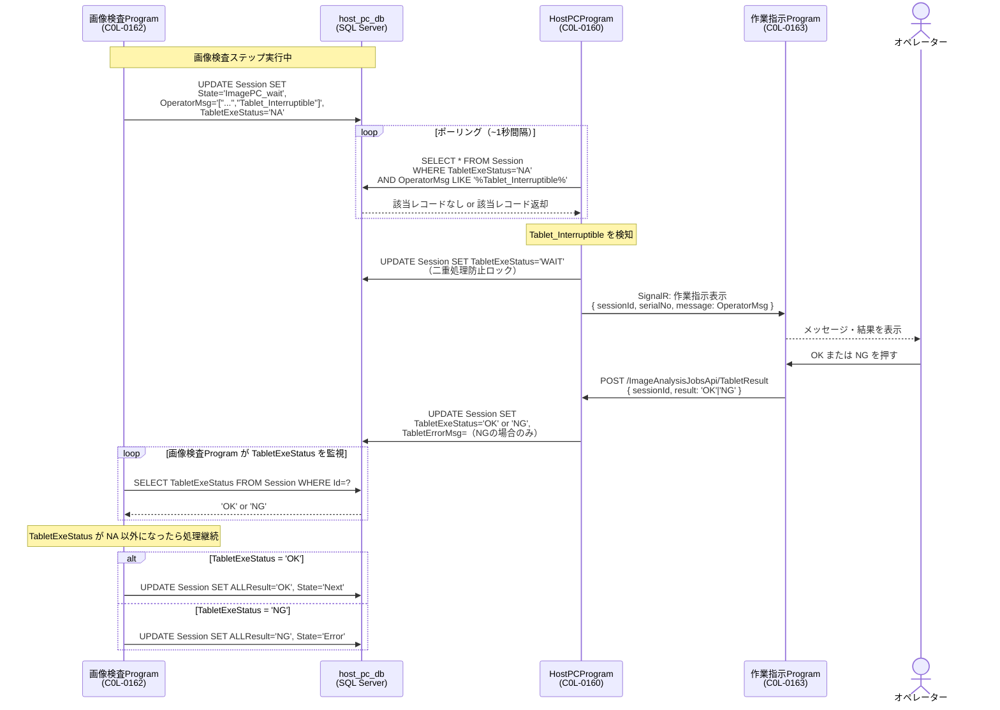

# 10 `host_pc_db` 連携フロー・API設計

> **DB**: `host_pc_db`（旧 `image_inspection_db` / SQL Server / km.local 10.183.29.246,1433）— 保証工程の中心トランザクションDB  
> **所有アプリ**: HostPcアプリ（CarrotRape）。MiniPC・タブレット・画像検査PC はこのアプリの WebAPI を介して連携する。  
> **現行方針**: 旧版の「HostPCProgram が DB をポーリングして仲介する暫定構成」は、HostPcアプリ中心構成に置き換わりました（→ [12_host_pc_app_pivot.md](12_host_pc_app_pivot.md)）。
> 以下の本文は旧構成の連携フロー（参考）です。`Session` テーブルの実仕様はリポジトリ `CarrotRape` が正となります。

---

## 1. 全体フロー

### 1.1 Spica 画像検査 全体シーケンス（概念図）

> 製品は最大4台並列で動作する。この図では1台分で代表表示。

```mermaid
sequenceDiagram
    box 製品側（最大4台並列）
        participant Product as 製品<br>（内蔵スキャナー）
    end
    participant FTP as FTPフォルダ<br>C:\inetpub\ftproot
    participant MiniPC as MiniPC<br>（サーバー）
    participant HostPC as HostPC<br>(HostPCProgram)
    participant DB as 画像処理DB<br>(host_pc_db)
    participant ImgPC as 画像検査PC<br>(C0L-0162)
    participant Tablet as Tablet<br>（作業指示Program）

    == 1. スキャン画像を送る ==

    Product->>FTP: スキャン画像を FTP 経由で送付
    FTP->>MiniPC: 新しい画像ファイルを検知
    Note right of MiniPC: 重複防止のため<br>ファイル名に固有シリアルを付与して保存
    MiniPC->>MiniPC: 自分の担当画像であればファイル名を変更<br>（シリアル＋日付＋PC名＋工程名）

    == 2. HostPC へ送付 ==

    MiniPC->>HostPC: WebAPI でアップロード（解析指示）
    HostPC->>HostPC: 解析画像をローカルフォルダに保存
    HostPC->>DB: 処理待ち JOB を登録
    MiniPC->>HostPC: 解析結果問い合わせ（Loop）

    == 3. 画像検査PC が解析 ==

    ImgPC->>DB: 処理待ち JOB を確認
    ImgPC->>HostPC: 解析対象画像を取得
    ImgPC->>ImgPC: 画像解析を実施
    ImgPC->>DB: 解析結果を登録<br>（OK / NG、NG項目）

    == 4. MiniPC が結果確認 ==

    MiniPC->>HostPC: 解析結果問い合わせ（Loop）
    HostPC->>DB: 結果を確認
    DB-->>HostPC: 結果を通知
    HostPC-->>MiniPC: 結果を通知

    alt 結果が OK
        MiniPC->>Product: 次の工程へ進める
    else 結果が NG
        MiniPC->>Tablet: NG メッセージを表示
    end
```

### 1.2 Tablet_Interruptible 連携フロー（詳細）

画像検査中にオペレーター確認が必要な場合（`OperatorMsg` に `"Tablet_Interruptible"` が含まれるとき）の連携。

```
画像検査Program     host_pc_db     HostPCProgram     作業指示Program
  (C0L-0162)        (SQL Server)              (C0L-0160)            (C0L-0163)
      │                   │                       │                      │
      │  INSERT/UPDATE     │                       │                      │
      │─ Session ─────────>│                       │                      │
      │  OperatorMsg に    │  ポーリング（~1秒）     │                      │
      │  "Tablet_          │<──── SELECT ──────────│                      │
      │  Interruptible"    │                       │                      │
      │  を含める          │  Tablet_Interruptible  │                      │
      │                   │  を検知                │                      │
      │                   │──── 返却 ─────────────>│                      │
      │                   │                       │── SignalR push ──────>│
      │                   │                       │   (OperatorMsg内容)   │
      │                   │                       │                  オペレーター確認
      │                   │                       │<── OK / NG ──────────│
      │                   │  UPDATE                │                      │
      │                   │<─ TabletExeStatus ─────│                      │
      │                   │   = 'OK' or 'NG'       │                      │
      │  SELECT            │                       │                      │
      │<─ TabletExeStatus ─│                       │                      │
      │  を監視して継続     │                       │                      │
```

---

## 2. シーケンス図（詳細）



---

## 3. host_pc_db テーブル詳細

### 3.1 `Session`（メインセッション管理テーブル）

HostPCProgram が**読む**列・**書く**列を明示する。

| 列名 | 型 | HostPCProgram | 説明 |
|-----|----|--------------------|------|
| `Id` | int | **READ** | セッションID（PK） |
| `SerialNo` | nvarchar | **READ** | 機器シリアル番号 |
| `MODELTYPE` | nvarchar | **READ** | 機種タイプ |
| `MACHINECODE` | nvarchar | **READ** | 機種コード |
| `SequenceTYPE` | nvarchar | **READ** | 現在の工程タイプ |
| `SequenceNo` | int | **READ** | 現在のシーケンス番号 |
| `State` | nvarchar | **READ** | 現在の状態（`ImagePC_wait` = 画像検査中） |
| `ALLResult` | nvarchar | **READ** | 全体結果（`WAIT` / `OK` / `NG`） |
| `OperatorMsg` | nvarchar | **READ** | タブレットに表示するメッセージ（JSON 配列） |
| `TabletNo` | nvarchar | **READ** | 担当タブレットの識別子（JSON 配列） |
| `TabletExeStatus` | nvarchar | **READ / WRITE** | タブレット操作状態（後述） |
| `TabletErrorMsg` | nvarchar | **WRITE** | NG 時のエラーメッセージ |
| `TabletElapsedTime` | int | READ のみ | タイムアウト時間（秒） |
| `UpdateTime` | datetime2 | 参照のみ | 最終更新日時 |
| `RaspiExeStatus` | nvarchar | 参照のみ | 画像検査Program 側の実行状態 |

#### `TabletExeStatus` の値と意味

| 値 | 設定者 | 意味 |
|----|--------|------|
| `NA` | 画像検査Program | 初期値。タブレット未操作 |
| `WAIT` | **HostPCProgram** | タブレットに通知済み・応答待ち |
| `OK` | **HostPCProgram** | オペレーターが OK を選択 |
| `NG` | **HostPCProgram** | オペレーターが NG を選択 |

> `WAIT` への更新は、重複ポーリング処理防止のためのロック。`NA` → `WAIT` は **HostPCProgram** が行い、その後 SignalR 送信する。

#### `OperatorMsg` の形式

JSON 配列の文字列。`"Tablet_Interruptible"` が含まれている場合がタブレット入力が必要なシグナル。

```json
[
  "20251014_154836103",
  "Please_Input_Rework_StartSequenceNo   Note: [Y + Enter]=Continue or [N + Enter]=QUIT",
  "Tablet_Interruptible"
]
```

---

### 3.2 `ImageAnalysisJob`（画像検査ジョブ結果）

HostPCProgram は主に **READ** 用途（結果確認・表示）。

| 列名 | 型 | 用途 | 説明 |
|-----|----|----|------|
| `Id` | int | READ | ジョブ ID（PK） |
| `SessionId` | int | READ | `Session.Id` への外部参照 |
| `SERIALNO` | nvarchar | READ | 機器シリアル番号 |
| `MACHINECODE` | nvarchar | READ | 機種コード |
| `SequenceTYPE` | nvarchar | READ | 工程タイプ |
| `JUDGERESULT` | nvarchar | READ | 最終判定結果 |
| `JUDGE` | nvarchar | READ | 判定結果詳細 |
| `STAGE_LETTER` | nvarchar | READ | 検査ステージ |
| `CHART_NAME` | nvarchar | READ | 使用チャート名 |
| `PAPER_SIZE` | nvarchar | READ | 用紙サイズ |
| `ADJUSTN` | int | READ | 調整回数 |
| `TRYN` | int | READ | 試行回数 |
| `UpdateTime` | datetime2 | READ | 最終更新日時 |

---

### 3.3 参照のみテーブル（HostPCProgram は READ のみ）

| テーブル名 | 用途 |
|-----------|------|
| `Jig_Process` | 工程定義JSON（SequenceTYPE ごとのステップ定義） |
| `ImageProcess` | 画像検査設定（チャート・解像度等） |
| `ImageScanData` | スキャンデータ（検査結果の補助情報） |
| `TabletRelation` | タブレット割り当てマスタ（SerialNo+SequenceTYPE → TabletNo） |
| `CheckProcessSkip` | 再作業時のスキップ情報 |

---

## 4. HostPCProgram 実装仕様

### 4.1 新規 API エンドポイント（`ImageAnalysisJobsApi`）

| メソッド | エンドポイント | 用途 |
|---------|-------------|------|
| `GET` | `/ImageAnalysisJobsApi/Pending` | タブレット入力待ちセッション一覧取得 |
| `POST` | `/ImageAnalysisJobsApi/TabletResult` | タブレット OK/NG 結果を Session に反映 |
| `GET` | `/ImageAnalysisJobsApi/Jobs?serialNo=` | 指定シリアルの ImageAnalysisJob 取得 |

---

### 4.2 ポーリング処理（バックグラウンドサービス）

`IHostedService` として実装し、`~1秒間隔`で以下の SQL を実行する。

```sql
-- タブレット入力が必要なセッションを検索
SELECT Id, SerialNo, OperatorMsg, TabletNo, TabletElapsedTime
FROM Session
WHERE TabletExeStatus = 'NA'
  AND OperatorMsg LIKE '%Tablet_Interruptible%'
```

検知したら：
1. `TabletExeStatus = 'WAIT'` に UPDATE（二重処理防止）
2. `TabletRelation` から対応タブレットを解決
3. SignalR で `作業指示Program` へプッシュ

---

### 4.3 タブレット結果受信（`POST /ImageAnalysisJobsApi/TabletResult`）

```json
// Request body
{
  "sessionId": 33041,
  "result": "OK",        // "OK" or "NG"
  "operatorCode": "U001" // オペレーターID（任意）
}
```

受信後の DB 更新：

```sql
UPDATE Session
SET TabletExeStatus = @result,          -- 'OK' or 'NG'
    TabletErrorMsg  = @errorMsg,        -- NG の場合のみ
    UpdateTime      = GETDATE()
WHERE Id = @sessionId
  AND TabletExeStatus = 'WAIT'          -- 楽観的ロック
```

---

## 5. 画像検査Program を変更しない理由と制約

画像検査Program（C0L-0162）が `Session` テーブルを更新するロジックは**そのまま流用**する。

| C0L-0162 が設定する値 | HostPCProgram の対応 |
|---------------------|--------------------------|
| `State = 'ImagePC_wait'` | 参照のみ（ログ・Dashboard 用） |
| `OperatorMsg` に `"Tablet_Interruptible"` | **この値を検知してタブレット通知のトリガーとする** |
| `TabletExeStatus = 'NA'` | `'WAIT'` → `'OK'/'NG'` に HostPCProgram が更新 |
| `TabletNo` に担当タブレット ID | SignalR の送信先解決に使用 |

> **制約**: HostPCProgram は `Session.ALLResult` や `State` を**更新しない**。  
> これらは画像検査Program が管理するため、誤って上書きすると画像検査の動作が壊れる。

---

## 6. 作業指示Program（C0L-0163）への表示仕様

SignalR で受け取るペイロード（既存の MANUAL Step と同じハブを使用）：

```json
{
  "type": "imageInspection",
  "sessionId": 33041,
  "serialNo": "Z2M5400023",
  "messages": [
    "20251014_165856103",
    "JUDGE=NG...ProcessName=DP_CCD_Test using 3400_A_MC1RC2_A3_DEFAULT.json",
    "右角度 0.03 deg（基準: ±0.05以内）"
  ],
  "timeoutSeconds": 330
}
```

タブレット側の表示：
- `messages` の内容をテキスト表示
- `timeoutSeconds` でタイムアウト警告表示
- 「OK」「NG」ボタンで `POST /ImageAnalysisJobsApi/TabletResult` を呼ぶ

---

## 7. 関連ドキュメント

- [`08_image_inspection.md`](08_image_inspection.md) — 旧機種 RasPi 画像検査フロー調査結果
- [`07_system_design.md`](07_system_design.md) — システム全体設計（HostPCProgram の役割）
- [`05_sequence.md`](05_sequence.md) — 既存工程の MANUAL Step フロー（参考）
- [`09_schedule.md`](09_schedule.md) — 開発スケジュール（画像検査API は 6/10〜7/3）
