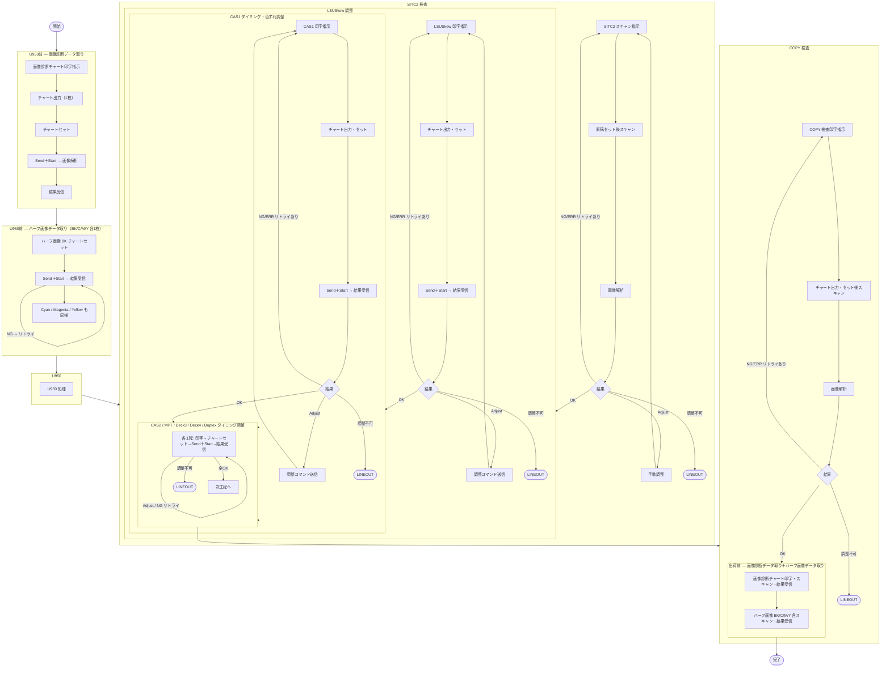
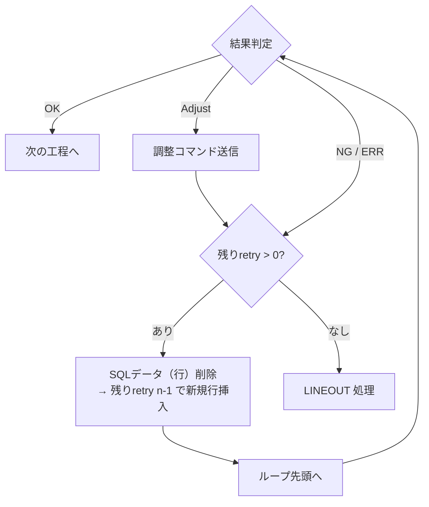

# 11 画像検査 現行システム詳細フロー（GC02V9 / SITC2）

> **ドキュメントの目的**  
> 現行の画像検査システム（GC02V9 / SITC2）における参加者間インタラクションと  
> 全体作業フローを記録し、Spica 向け実装の参考仕様とする。  
> PlantUML ソースは [`docs/sequence/`](sequence/) に格納。

---

## 1. 登場人物（コンポーネント）

### 1.1 GC02V9 システム

| 参加者 | 説明 |
|-------|------|
| 作業者A | 紙のセット・スキャン操作を行う |
| 作業者B | HostPC 起動・停止、全体監視を行う |
| HostPC（GC02V9用） | 統括バッチファイルを実行し、RasPi・画像処理PC と連携。SQL Server と通信してリトライ管理も行う |
| 画像処理PC（GC02V9） | `新GC02V9画像処理用.bat` を実行。バーコード読み取り・`ImageAdj.exe` 呼び出し・MOM用ファイル作成・WebAPI 送信を担う |
| RasPi | マシンへの接続・電源確認・プリスクライブファイル転送・調整コマンド送信を行う |
| マシン | GC02V9 対応機種。印字・スキャン動作を行う |
| 実機治具スキャナー | 作業者が紙をセットし Send+Start を押すと画像を FTP で画像処理PC へ送信する |

### 1.2 SITC2 システム

| 参加者 | 説明 |
|-------|------|
| 作業者A | SITC2 原稿設置・Tablet 操作を行う |
| 作業者B | HostPC 起動・停止、全体監視を行う |
| HostPC（SITC2用） | 統括バッチファイルを実行し、RasPi・画像処理PC と連携 |
| 画像処理PC（SITC2） | `旧SITC2画像処理用.bat` を実行。バーコード読み取り・`imageSITC2.exe` 呼び出し・MOM用ファイル作成・WebAPI 送信を担う |
| RasPi | マシンへの接続・Tablet へのスキャン指示・スキャン条件送信を行う |
| マシン（スキャナー） | SITC2 対応機種。スキャン動作を行い画像を FTP 送信する |
| Tablet | 作業者への SCAN ボタン表示・HostPC 側への結果入力 UI |

---

## 2. GC02V9 全体作業フロー（作業者視点）

各検査工程の実施順序。NG/ERR 発生時はリトライ（最大 n 回）後、LINEOUT となる。



> **注意事項（全体フローより）**  
> - データ活用先は QLIKSENSE 用 SQL サーバーではなく MES（MOM）へ送信する  
> - SITC2 検査の自動スキャン方式（タブレット経由）は検討中  
> - 出荷前データ取りでスキャン失敗した場合の NG 画像判定は未検討

---

## 3. GC02V9 システム間インタラクション（詳細シーケンス）

`新GC02V9画像処理用.bat` を中心とした参加者間の詳細メッセージフロー。

```mermaid
sequenceDiagram
    actor workerA as 作業者A
    actor workerB as 作業者B
    participant hostPC as HostPC<br>(GC02V9用)
    participant imagePC as 画像処理PC<br>(新GC02V9画像処理用.bat)
    participant raspi as RasPi
    participant machine as マシン
    participant scanner as 実機治具スキャナー

    == 起動・初期化 ==

    workerB->>hostPC: C#START ボタン押下<br>統括バッチファイルをクリック（初回のみ）
    Note over hostPC: ・C:\inetpub\ftproot\Athena の中身を削除<br>・OngoingImageAdjust.txt を削除<br>・新GC02V9画像処理用.bat 実行<br>・Scan条件を治具スキャナーへ5秒ごとに送信

    workerA->>machine: RasPi をマシンへ挿入
    hostPC->>imagePC: 新GC02V9画像処理用.bat 起動指示
    imagePC->>imagePC: バッチ実行開始

    == GC02V9 検査シーケンス（工程情報より順次ループ） ==

    loop 各工程（例：A3機 色ずれ調整）

        hostPC->>raspi: 接続（来たよ）
        raspi->>machine: 電源ON 確認
        machine-->>raspi: 電源ON 応答
        raspi<<->>machine: マシン情報交換<br>（SN, Kishu, Life, TopLeft, CmdLine）
        raspi-->>hostPC: マシン情報返信

        hostPC->>hostPC: プリスクライブファイル加工
        Note right of hostPC: SQL Insert（ImageAdj用テーブル）:<br>・SN条件で Select<br>・なければ新規行挿入（残りretry=3 等）<br>・あればその行へ情報を挿入

        hostPC->>raspi: プリスクライブファイルを送信
        raspi->>machine: プリスクライブファイルを転送
        machine->>machine: GC02V9 画像検査実施
        machine-->>raspi: 紙出力終了
        raspi-->>hostPC: 印字終了を通知
        hostPC-->>imagePC: 印字終了通知

        workerA->>scanner: スキャン作業（紙設置後 Send+Start）
        scanner->>imagePC: 画像.jpg を FTP 送信<br>(C:\inetpub\ftproot\Athena\画像.jpg)

        imagePC->>imagePC: BarcodeRead.exe 実行<br>（バーコード情報取得）
        Note right of imagePC: C:\inetpub\ftproot\画像.jpg<br>→ Athena\ へ移動<br>・A4Y と A3 の場所を解析<br>・3段バーコード読み取り

        imagePC-->>hostPC: SQL Select 要求<br>（Machine_Info, CmdLine_Info）
        hostPC-->>imagePC: SQL 結果（CmdLine, SN 等）

        alt 情報取得成功（レコードが1件存在）
            imagePC->>imagePC: 旧 imageSITC2.exe グループ終了待ち<br>（OngoingImageSITC2.txt 存在確認 Loop）
            imagePC->>imagePC: OngoingImageAdjust.txt 作成（実行中判定用）
            imagePC->>imagePC: ImageAdj.exe 実行（CmdLine情報より）
            imagePC->>imagePC: 最新画像.jpg 解析
            Note right of imagePC: 色ずれの場合、より厳しい管理値を使用<br>（OK判定列で定義）
            imagePC->>imagePC: 結果処理<br>（OngoingImageAdjust.txt 削除）

            alt 結果 = Adjust
                imagePC->>imagePC: Adjust 調整コマンドファイル作成
            else 結果 = OK / NG / ERR
                imagePC->>imagePC: 実行ファイル終了
            end

            imagePC->>imagePC: MOM用結果ファイル作成<br>（HostPC共有フォルダへ保存）
            imagePC-->>hostPC: WebAPI 送信<br>（① OK/NG/ERR ② Adjust調整コマンド ③ MOM用）

        else 情報取得失敗
            imagePC-->>hostPC: WebAPI 送信（ERROR）
        end

        hostPC->>hostPC: 結果受け取り（OK / NG / ERR / Adj）
        hostPC->>hostPC: SNと残りretryをゲット → SQLデータ（行）削除
        Note right of hostPC: NG/ERR の場合:<br>・残りretry > 0 → SN と n-1 の新規行挿入（リトライ）<br>・残りretry ≦ 0 → LINEOUT 処理へ<br>削除前に INSERT To 履歴テーブル

        alt 結果 = Adjust
            hostPC->>raspi: 調整CMDをマシンへ送信
            raspi->>machine: 調整実施
            hostPC->>hostPC: CmdLine にて Rangeファイルを変更
            Note right of hostPC: Adjust の場合も残り RetryN を設ける方向
        else 結果 = OK
            hostPC->>hostPC: 次の工程へ
        else 結果 = NG/ERR（残りretry > 0）
            hostPC->>hostPC: リトライ（ループ）
        else 結果 = NG/ERR（残りretry ≦ 0）
            hostPC->>hostPC: LINEOUT 処理へ
        end

    end

    == 検査終了 ==

    workerB->>hostPC: C#統括画面で STOP 後、×ボタンで閉じる（全終了）
    workerB->>imagePC: STOP ボタンを押す（バッチ終了）
```

---

## 4. SITC2 システム間インタラクション（詳細シーケンス）

`旧SITC2画像処理用.bat` を中心とした参加者間の詳細メッセージフロー。

```mermaid
sequenceDiagram
    actor workerA as 作業者A
    actor workerB as 作業者B
    participant hostPC as HostPC<br>(SITC2用)
    participant imagePC as 画像処理PC<br>(旧SITC2画像処理用.bat)
    participant raspi as RasPi
    participant machine as マシン（スキャナー）
    participant tablet as Tablet

    == 起動・初期化 ==

    workerB->>hostPC: C#START ボタン押下<br>統括バッチファイルをクリック（初回のみ）
    Note over hostPC: ・C:\inetpub\ftproot\AthenaSITC2 の中身を削除<br>・OngoingImageSITC2.txt を削除<br>・旧SITC2画像処理用.bat 実行<br>・Scan条件を治具スキャナーへ5秒ごとに送信

    workerA->>machine: RasPi をマシンへ挿入
    hostPC->>imagePC: 旧SITC2画像処理用.bat 起動指示
    imagePC->>imagePC: バッチ実行開始

    == SITC2 検査シーケンス（工程情報より順次ループ） ==

    loop 各工程（例：LOW機 ISU検査）

        hostPC->>raspi: 接続（来たよ）
        raspi->>machine: 電源ON 確認
        machine-->>raspi: 電源ON 応答
        raspi<<->>machine: マシン情報交換
        raspi-->>hostPC: マシン情報返信

        hostPC->>raspi: SITC2原稿紙スキャン指示（SN, Kishu, Life 等）
        raspi->>tablet: SITC2原稿紙を設置後 SCAN ボタンを押すよう指示
        tablet-->>workerA: スキャン指示表示

        workerA->>machine: SITC2原稿設置
        workerA->>tablet: SCAN ボタンを押す
        tablet->>raspi: SCAN 指示
        raspi->>machine: スキャン条件＋Send＋StartCmd 送信
        machine->>machine: スキャン実行
        machine-->>raspi: スキャン完了・画像.jpg FTP 送信
        raspi->>imagePC: スキャン条件＋紙出力終了通知

        imagePC->>hostPC: SQL Select 要求<br>（Machine_Info, CmdLine_Info）
        Note right of imagePC: SITC2用の行をフィルター、Top1行を取得
        hostPC-->>imagePC: SQL 結果

        imagePC->>imagePC: 画像ファイルを WebAPI で問い合わせ待ち<br>（SITC2_SN_機種_LifeCount_DEFAULT.jpg）
        Note right of imagePC: C:\inetpub\ftproot\ImageSITC2\ へ保存

        imagePC->>imagePC: BarcodeRead.exe → 原稿管理No 取得
        imagePC->>imagePC: PC内に原稿管理No を検索

        alt 原稿管理No が見つかった場合
            imagePC->>imagePC: SITC2masterLength%kanriNo%.csv<br>→ SITC2masterLengthSelect.csv へコピー
            Note right of imagePC: CSV の場所は HostPC 共有フォルダへ変更
            imagePC->>imagePC: ImageAdj.exe グループ終了待ち<br>（OngoingImageAdjust.txt 存在確認 Loop）
            imagePC->>imagePC: OngoingImageSITC2.txt 作成（実行中判定用）
            imagePC->>imagePC: imageSITC2.exe 実行（改造版）
            imagePC->>imagePC: 画像.jpg を解析<br>(C:\inetpub\ftproot\AthenaSITC2\画像.jpg)
            Note right of imagePC: ExitCode=0(OK) / 11(NG) / その他(ERR)<br>FTPフォルダ名は ImageAdjust と別に変更済み
            imagePC->>imagePC: 結果処理<br>（OngoingImageSITC2.txt 削除）
            imagePC->>imagePC: MOM用結果ファイル作成<br>（HostPC共有フォルダへ保存）
            imagePC-->>hostPC: WebAPI 送信<br>（ExitCode より OK/NG/ERR ＋ MOM用）

        else 原稿管理No が見つからない場合
            imagePC-->>hostPC: WebAPI 送信（ERROR）
        end

        hostPC->>hostPC: 結果受け取り（OK / NG / ERR）
        hostPC->>hostPC: SN と残りretry をゲット → SQLデータ（行）削除
        Note right of hostPC: NG/ERR の場合:<br>・残りretry > 0 → SN と n-1 の新規行挿入（リトライ）<br>・残りretry ≦ 0 → LINEOUT 処理へ<br>削除前に INSERT To 履歴テーブル

        alt 結果 = OK
            hostPC->>hostPC: 次の工程へ
            Note right of hostPC: 画像.jpg を Rename<br>→ SN_機種_LifeCount_Cas1.jpg として保管
        else 結果 = NG/ERR（残りretry > 0）
            hostPC->>hostPC: リトライ（ループ）
        else 結果 = NG/ERR（残りretry ≦ 0）
            hostPC->>hostPC: LINEOUT 処理へ
        end

    end

    == 検査終了 ==

    workerB->>hostPC: C#統括画面で STOP 後、×ボタンで閉じる（全終了）
    workerB->>imagePC: STOP ボタンを押す（バッチ終了）
    Note over workerB,imagePC: NG/ERR 確認手順（NGまたはERRのみ）:<br>・どの項目がNGか確認後クリックして次へ（クリックレス化検討中）<br>・性能的なNG → 簡易文字列を Host→Tablet へ表示<br>・ポップアップなしのエラー処理は実現可能
```

---

## 5. GC02V9 / SITC2 共通: リトライロジック



**SQL 操作まとめ（HostPC 側）:**

| タイミング | 操作 |
|-----------|------|
| 工程開始時（SN未登録） | ImageAdj用テーブルに新規行挿入（残りretry=3 等） |
| 工程開始時（SN登録済み） | 既存行に情報を更新 |
| 結果受信後（共通） | 現在行を削除する前に履歴テーブルへ INSERT |
| OK の場合 | 現在行を削除して次工程へ |
| NG/ERR でリトライあり | 現在行を削除 → 残りretry-1 で新規行挿入 |
| NG/ERR でリトライ切れ | LINEOUT 処理 |

---

## 6. ファイルパス・実行ファイル一覧

### GC02V9

| ファイル | パス | 用途 |
|---------|------|------|
| `新GC02V9画像処理用.bat` | 画像処理PC | GC02V9用メインバッチ |
| `BarcodeRead.exe` | 画像処理PC | バーコード読み取り |
| `ImageAdj.exe` | 画像処理PC | 画像解析本体 |
| `OngoingImageAdjust.txt` | C:\inetpub\ftproot\（画像処理PC） | 実行中判定用ロックファイル |
| 受信画像フォルダ | C:\inetpub\ftproot\Athena\ | 治具スキャナーからの FTP 受信先 |

### SITC2

| ファイル | パス | 用途 |
|---------|------|------|
| `旧SITC2画像処理用.bat` | 画像処理PC | SITC2用メインバッチ |
| `imageSITC2.exe` | 画像処理PC | SITC2画像解析本体（改造版） |
| `SITC2masterLength%kanriNo%.csv` | HostPC 共有フォルダ | 原稿管理No 対応マスタ |
| `SITC2masterLengthSelect.csv` | 画像処理PC | 解析時に使用するコピー先 |
| `OngoingImageSITC2.txt` | 画像処理PC | 実行中判定用ロックファイル |
| 受信画像フォルダ | C:\inetpub\ftproot\AthenaSITC2\ | マシンスキャン画像の FTP 受信先<br>（Athena と別フォルダ、バッティング回避） |
| 保存画像フォルダ | C:\inetpub\ftproot\ImageSITC2\ | SITC2 専用保存先 |

---

## 7. Spica 向け実装との対応

GC02V9/SITC2 の現行フローと Spica 新アーキテクチャ（[`10_image_inspection_api.md`](10_image_inspection_api.md)）の対応関係。

| 現行（GC02V9/SITC2） | Spica 向け |
|---------------------|------------|
| RasPi | MiniPC（C0L-0161） |
| HostPC（バッチ統括） | HostPCProgram（C0L-0160） |
| 画像処理PC（バッチ） | 画像検査Program（C0L-0162）※変更しない方針 |
| SQL Server（ImageAdj用テーブル） | `host_pc_db`（暫定構成）|
| 治具スキャナー FTP → Athena\ | 製品内蔵スキャナー FTP → `host_pc_db` 経由 |
| WebAPI（HostPC → 画像処理PC） | WebAPI（HostPCProgram ↔ 画像検査Program） |
| 調整コマンド（RasPi → マシン） | MiniPC → マシン（TCP コマンド） |
| ポップアップ制御（未解決） | `Tablet_Interruptible` + SignalR 方式で解決 |

> **現行システム固有の課題（Spica 向けで解決済みまたは検討中）**
> - SITC2 スキャン時のポップアップ非表示、戻り値の扱い → SignalR 方式に変更
> - 原稿管理No の場所（HostPC 共有フォルダ方式）
> - ImageAdj と imageSITC2 の排他制御（OngoingXxx.txt によるロック）

---

## 8. 関連ドキュメント

- [`08_image_inspection.md`](08_image_inspection.md) — 旧機種 RasPi プログラム調査結果
- [`08_image_inspection_db.md`](08_image_inspection_db.md) — `host_pc_db` スキーマ（暫定構成）
- [`10_image_inspection_api.md`](10_image_inspection_api.md) — Spica 向け HostPCProgram API 設計
- [`docs/sequence/`](sequence/) — PlantUML ソースファイル
