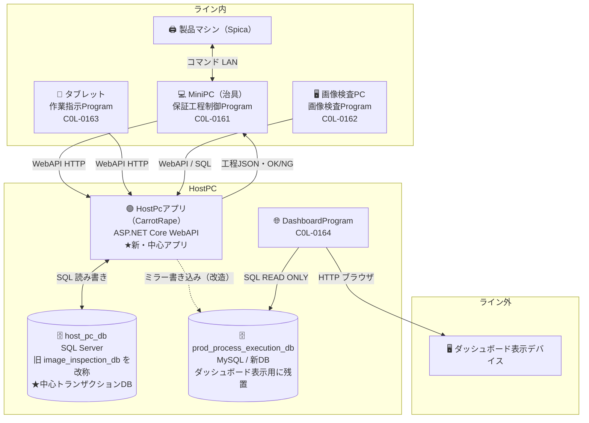
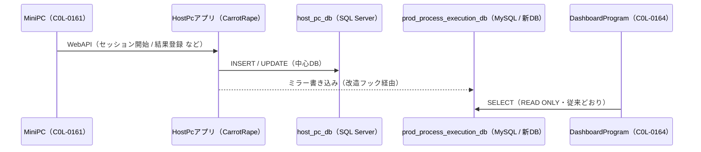
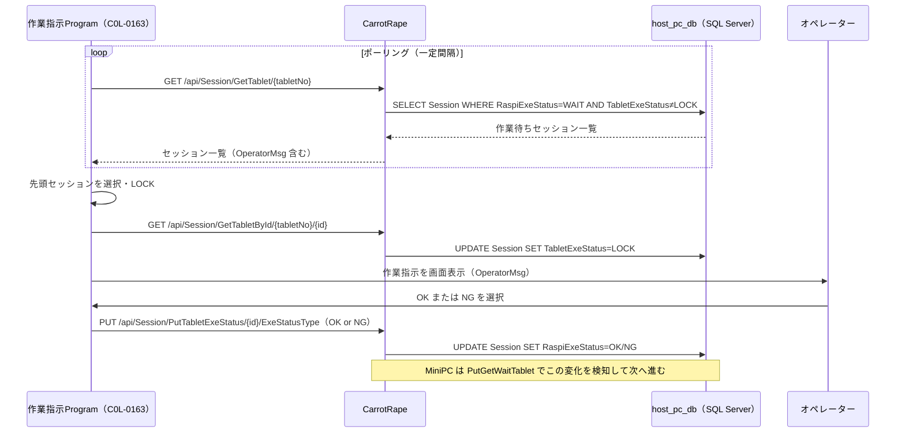

# 12 仕様変更: HostPcアプリ中心アーキテクチャへの移行

> **このドキュメントが現行の最新方針です。**
> 既存ドキュメント（01〜11）は MiniPC → HostPCProgram → `prod_process_execution_db`（MySQL）を
> 中心とした旧アーキテクチャを前提にしています。本書はそこからの**大きな仕様変更**を定義し、
> 旧ドキュメントとの差分・読み替えルールをまとめます。矛盾する場合は本書を優先してください。

---

## 1. 何が変わったか（サマリー）

| 観点 | 旧（01〜11 の前提） | 新（本書） |
|------|------------------|-----------|
| MiniPC の主たる連携先 | HostPCProgram（C0L-0160）の WebAPI | **HostPcアプリ（CarrotRape）の WebAPI** |
| トランザクションの中心DB | `prod_process_execution_db`（MySQL / 新DB） | **`host_pc_db`（SQL Server / 旧DB＝旧 `image_inspection_db` を改称）** |
| MiniPC のDB書き込み | HostPCProgram 経由で MySQL に書き込み | **DBには直接INSERTしない。HostPcアプリにAPIを発行**して登録・更新を委譲 |
| 工程JSON（治具JSON）の受け渡し | HostPCProgram の `/ProcessFileApi/*` | **HostPcアプリが提供**（`/api/Session/{id}/Next` 等） |
| `prod_process_execution_db`（新DB） | 中心DB | **ダッシュボード表示用に残置**（HostPcアプリがミラー書き込み） |
| 画像検査 | `image_inspection_db` を介した「暫定構成」 | `host_pc_db` が**正式な中心DB**。暫定ではなくなった |

> **マシン特定の原則は不変**: すべての処理でマシンを特定するキーは **シリアル番号** を使用する。

---

## 2. 用語の読み替え

旧ドキュメントを読むときは、以下のように読み替えてください。

| 旧ドキュメントの表記 | 新しい意味 |
|--------------------|-----------|
| `image_inspection_db` | **`host_pc_db`**（改称のみ。中身・サーバーは同一） |
| 「画像検査専用DB」「暫定構成の専用DB」 | **保証工程の中心トランザクションDB**（暫定ではない） |
| MiniPC → HostPCProgram の各 API（`/ProcessFileApi`, `/MachineApi`, `/StepApi`） | **HostPcアプリ（CarrotRape）の対応 API**（§4 の対応表参照） |
| 「将来的に MiniPC→API 構成に統一」 | **本移行で実現済み**（統一先が HostPcアプリ） |

- **HostPcアプリ** = リポジトリ `CarrotRape`。HostPC 上で動作する ASP.NET Core WebAPI。
  `host_pc_db`（SQL Server）を所有し、MiniPC・タブレット・画像検査PC からの API を捌く。

---

## 3. 新アーキテクチャ構成図



- **MiniPC は `host_pc_db` に直接 INSERT しない。** すべて HostPcアプリの WebAPI 経由で登録・更新する。
- **JSON ファイル（治具/工程JSON）のやりとりは HostPcアプリが担当**する（`Jig_Process.JsonData` を配信）。
- **`prod_process_execution_db`（新DB）はダッシュボードのために残す。** ダッシュボードは新DBに合わせて作成済みのため、
  HostPcアプリ側を改造して `host_pc_db` への登録と同時に新DBへもミラー書き込みする（§5）。

---

## 4. MiniPC → HostPcアプリ API 対応表

HostPcアプリ（CarrotRape）が既に提供している主なエンドポイント。旧 HostPCProgram API からの対応を示す。

| 目的 | 旧 HostPCProgram API | HostPcアプリ（CarrotRape）API |
|------|---------------------|------------------------------|
| 疎通確認 | （Ping） | `GET /api/ImageAnalysisJobs/GetCheck` / `GET /api/ImageAnalysisJobs/GetTime` |
| セッション開始（入室相当） | `POST /MachineApi/Enter` | `POST /api/Session` |
| 次の工程JSONを取得 | `GET /ProcessFileApi/Next` | `GET /api/Session/{id}/Next`（JSONのみ: `/api/Session/{id}/Next/Json`） |
| 同一/前/指定ステップ再取得 | （なし） | `GET /api/Session/{id}/Retry`・`/Previous`・`/SetStep/{seq}` |
| 工程結果の登録（OK/NG） | `POST /MachineApi/Complete` | `GET /api/Session/PutResultToId/{id}/{allResult}`（または `PutResultToLastLine`） |
| Raspi/治具からの返却データ登録 | `POST /StepApi/RecordStep` | `PUT /api/Session/{id}/ReturnData` |
| 状態更新 | `POST /StepApi/UpdateStep` | `PUT /api/Session/{id}/State` |
| タブレット作業指示の発行と結果待ち | `POST /StepApi/UpdateStep`＋コールバック | `GET /api/Session/PutGetWaitTablet/{id}/{elapsedTime}`（OperatorMsg を渡し OK/NG を取得） |
| 画像検査ジョブ登録 | （image_inspection_db に直接INSERT） | `POST /api/ImageAnalysisJobs/PostImageAnalysisJob` 等 |

> 上記はリポジトリ `CarrotRape` の `SessionController` / `ImageAnalysisJobsController` 実装に基づく。
> 実際に MiniPC から使うエンドポイントの確定版は結合時に取り決める。

---

## 5. 新DB（`prod_process_execution_db`）へのミラー書き込み

ダッシュボードは新DBに合わせて構築済みのため、新DBを残したまま HostPcアプリから書き込みを行う。

- HostPcアプリには既に**外部DBへ書き出すフック**が存在する（`appsettings.json` の
  `SqlForSessionExeFile` / `SqlForImageAnalysisJobExeFile`）。Session / ImageAnalysisJob を
  更新するたびに、フィールド名と値を引数にして外部実行ファイルを起動する仕組み。
- この仕組みを**改造**し、`host_pc_db` への登録・更新と同期して
  `prod_process_execution_db` の対応テーブルへもミラー INSERT/UPDATE する。
- ダッシュボード（C0L-0164）は従来どおり `prod_process_execution_db` を READ ONLY で参照する。
  読み替え不要で、新DBスキーマはそのまま使える。

> **`prod_process_execution_db`（MySQL）はダッシュボード専用。**  
> 作業指示Program（C0L-0163）は MySQL を参照しない。作業指示の取得・完了通知は HostPcアプリの API 経由で行う（→ §6）。



---

## 6. 作業指示Program（C0L-0163）の設計方針

### 6-1. 方針：CarrotRape API ポーリング

作業指示Program はタブレット上で動作し、**CarrotRape の SessionController API をポーリングして作業指示を取得・完了通知する。**

| 接続先 | 理由 |
|--------|------|
| ✅ CarrotRape API（`/api/Session`） | 作業指示データ（`Session.OperatorMsg`）は SQL Server の Session テーブルに格納されており、CarrotRape の `GetTablet` / `PutTabletExeStatus` エンドポイントがこの用途のために設計済み |
| ❌ MySQL（`prod_process_execution_db`）直接参照 | Session テーブル・OperatorMsg のミラー先が MySQL に存在しない。追加するコストに対して得られるメリットがない |

### 6-2. 使用するエンドポイント

| 操作 | エンドポイント |
|------|--------------|
| 作業待ちセッション取得（WAIT 絞り込み＋LOCK） | `GET /api/Session/GetTablet/{tabletNo}` |
| オペレーター OK/NG 送信 | `PUT /api/Session/PutTabletExeStatus/{id}/ExeStatusType` |
| 特定セッションをLOCK取得 | `GET /api/Session/GetTabletById/{tabletNo}/{id}` |
| LOCK 解除 | `PUT /api/Session/PutUnlockForTabletById/{id}` |

詳細は **[13_carrotrape_spec.md §5-1 および §6](13_carrotrape_spec.md)** を参照。

### 6-3. 作業指示取得フロー



### 6-4. MiniPC との役割分担

```
MiniPC（作業指示の発行側）
  → GET /api/Session/PutGetWaitTablet/{id}/0   ← 作業指示を開始（RaspiExeStatus=WAIT に設定）
  → GET /api/Session/PutGetWaitTablet/{id}/N   ← 完了を待機（ポーリング。Nは経過時間）

作業指示Program（表示・完了通知側）
  → GET /api/Session/GetTablet/{tabletNo}       ← WAIT セッションを検知
  → PUT /api/Session/PutTabletExeStatus/{id}/OK ← 完了通知（RaspiExeStatus が OK に変わる）
```

MiniPC と作業指示Program は直接通信せず、**CarrotRape の Session テーブルを介してやり取りする。**

---

## 7. 各コンポーネントの役割（更新後）

| コンポーネント | 役割（更新後） |
|--------------|--------------|
| MiniPC（C0L-0161） | 製品マシンを制御。**HostPcアプリの WebAPI を呼んで**工程JSON取得・結果登録を行う。DBへ直接アクセスしない |
| **HostPcアプリ（CarrotRape）** | **新・中心アプリ。** `host_pc_db` を所有し、MiniPC/タブレット/画像検査PC の API を捌く。工程JSON配信・新DBへのミラーを担う |
| `host_pc_db`（SQL Server） | **中心トランザクションDB**（旧 `image_inspection_db`）。Session / Jig_Process / ImageAnalysisJob / RaspiRelation / TabletRelation 等 |
| 画像検査Program（C0L-0162） | 実機スキャナで画像検査。`host_pc_db` と連携（暫定ではなく正式構成） |
| タブレット 作業指示Program（C0L-0163） | **CarrotRape の `GetTablet` / `PutTabletExeStatus` API をポーリング**して作業指示を表示・OK/NG を返す。MySQL（`prod_process_execution_db`）には接続しない（→ §6） |
| DashboardProgram（C0L-0164） | `prod_process_execution_db`（新DB）を READ ONLY 参照して表示。**変更なし** |
| HostPCProgram（C0L-0160） | 旧・中心アプリ。書き込みの主担当を HostPcアプリへ移管。役割は縮小（必要に応じて整理） |

---

## 8. 関連ドキュメント

- [`README.md`](../README.md) — 全体構成（本移行を反映）
- [`13_carrotrape_spec.md`](13_carrotrape_spec.md) — CarrotRape ソースコード調査に基づく DB・API 仕様（SessionController 詳細含む）
- [`08_image_inspection_db.md`](08_image_inspection_db.md) — `host_pc_db`（旧 `image_inspection_db`）スキーマ
- [`10_image_inspection_api.md`](10_image_inspection_api.md) — `host_pc_db` 連携 API・フロー
- [`07_system_design.md`](07_system_design.md) — 旧アーキテクチャのシーケンス（読み替え必要・冒頭注記参照）
- リポジトリ `CarrotRape` — HostPcアプリ本体（`SessionController` / `ImageAnalysisJobsController`）
