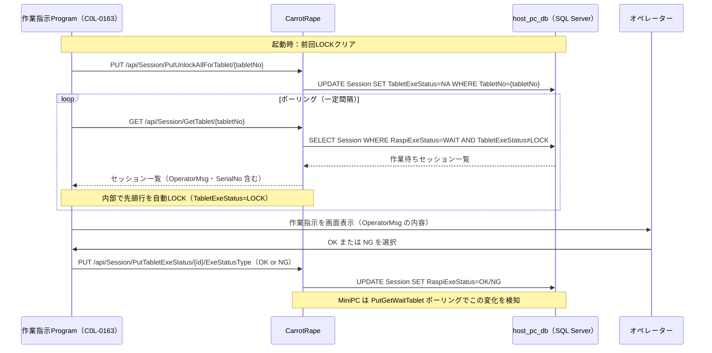
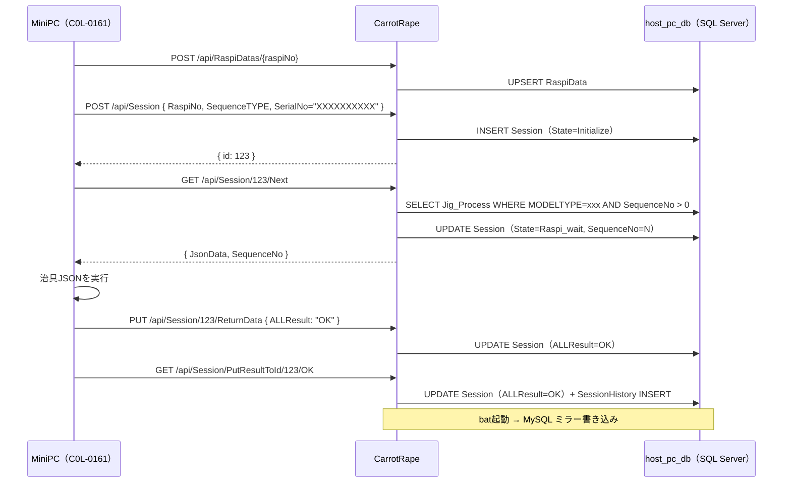

# 13 CarrotRape（HostPcアプリ）仕様書

> **本書は `C:\Users\k230415432\source\clone\CarrotRape` のソースコードを調査してまとめたものです。**  
> CarrotRapeはHostPC上で動作する ASP.NET Core (.NET 6) WebAPI で、  
> `host_pc_db`（SQL Server）を中心DBとして所有・管理します。  
> アーキテクチャ全体は **[12_host_pc_app_pivot.md](12_host_pc_app_pivot.md)** を参照。

---

## 1. 概要

| 項目 | 内容 |
|------|------|
| リポジトリ | `CarrotRape` |
| フレームワーク | ASP.NET Core / .NET 6 |
| 役割 | 保証工程の中心WebAPI。MiniPC・タブレット・画像検査PCのAPIを捌く |
| 中心DB | `host_pc_db`（SQL Server） |
| ミラーDB | `prod_process_execution_db`（MySQL）—ダッシュボード用のみ |
| Swagger | 全APIはSwaggerUIで確認可能（`/swagger`） |

---

## 2. DB接続構成（`appsettings.json`）

```json
{
  "ConnectionStrings": {
    "DefaultConnection": "Data Source=...;Initial Catalog=host_pc_db;...",
    "MySqlConnection": "Server=...;Database=prod_process_execution_db;..."
  },
  "SqlForSessionExeFile":            "C:\\IMAGEDATA\\SqlForSessionTable\\SQL_RUN_EXE_SESSION.bat",
  "SqlForImageAnalysisJobExeFile":   "C:\\IMAGEDATA\\SqlForImageAnalsysJobTable\\SQL_RUN_EXE_IMAGE.bat"
}
```

- **`DefaultConnection`**: SQL Server（`host_pc_db`）—全DbContextが使用するメイン接続
- **`MySqlConnection`**: MySQL（`prod_process_execution_db`）—ダッシュボード用ミラー書き込み専用。作業指示Programは使わない
- **`SqlForSessionExeFile` / `SqlForImageAnalysisJobExeFile`**: MySQLへのミラー書き込みを行うバッチファイルのパス

---

## 3. SQL Server (`host_pc_db`) テーブル定義

CarrotRapeがEntity Framework Coreで管理する全テーブルを以下に示します。

### 3-1. Session（工程実行セッション）

**DbContext**: `SessionData`  
**Model**: `SessionControl`

| カラム名 | 型 | NULL | 説明 |
|---------|-----|------|------|
| `Id` | int | NO | セッションID（PK）。MiniPC(Raspi)が開始時に指定 |
| `MODELTYPE` | string | YES | 機種コード（シリアル番号の先頭3文字。例: `ZVH`） |
| `SequenceTYPE` | string | NO | 工程種別（例: `GCV9`, `SITC2`, `JOBFOROPERATOR`） |
| `SequenceNo` | int | NO | 現在処理中の工程番号（`Jig_Process.SequenceNo`に対応） |
| `SerialNo` | string | YES | マシンシリアル番号（未確定時は `XXXXXXXXXX`） |
| `RaspiNo` | string | YES | MiniPC識別番号 |
| `State` | StateType | NO | セッション状態（下記Enum参照） |
| `AGV_Area` | string | YES | AGVエリア情報 |
| `Line` | string | YES | ライン番号（例: `C41L`） |
| `Destination` | string | YES | 仕向け（例: `KDA`） |
| `ALLResult` | string | YES | 工程単位のOK/NG結果 |
| `NGReason` | string | YES | NGの理由（最大50文字でミラーに送信） |
| `JsonData` | string | YES | 治具JSONデータ（`Jig_Process.JsonData`のコピー） |
| `StartTime` | DateTime | NO | セッション開始日時 |
| `RaspiExeStatus` | ExeStatusType | NO | MiniPC側の実行状態（Raspiへの通知用） |
| `OperatorMsg` | List\<string\> | YES | **タブレットへ表示する作業指示メッセージリスト**（JSON格納）。作業指示Programはここを参照する |
| `TabletNo` | string | YES | 担当タブレットの識別番号 |
| `TabletExeStatus` | ExeStatusType | NO | タブレット側の実行状態 |
| `TabletErrorMsg` | List\<string\> | YES | タブレットからのエラーメッセージリスト（JSON格納） |
| `TabletElapsedTime` | int | NO | タブレット経過時間（最適化スコア計算に使用。初期値 -99999） |
| `TabletOptimizer` | decimal | NO | タブレット最適化スコア（初期値 -99999） |
| `UpdateTime` | DateTime | NO | 最終更新日時 |

#### StateType（セッション状態）

| 値 | 名前 | 意味 |
|----|------|------|
| 0 | `Initialize` | セッション発行直後の初期状態 |
| 1 | `Raspi_wait` | MiniPC(Raspi)の処理待ち |
| 2 | `UI_wait` | タブレット作業者の操作待ち（`JOBFOROPERATOR`） |
| 3 | `ImagePC_wait` | 画像検査PCの処理待ち（`GCV`/`SITC`系） |
| 9998 | `Illegal` | 異常状態 |
| 9999 | `Finish` | 工程完了 |

#### ExeStatusType（実行状態）

| 値 | 名前 | 意味 |
|----|------|------|
| 0 | `NA` | 初期化（未使用） |
| 1 | `WAIT` | 処理待ち（タブレットへの表示待ち） |
| 2 | `LOCK` | タブレットが排他制御中（他タブレットから取得不可） |
| 3 | `OK` | OK / Continue |
| 4 | `NG` | NG / 中断 / Quit |

---

### 3-2. SessionHistory（セッション変更履歴）

**DbContext**: `SessionDataHistory`  
**Model**: `SessionControlHistory`

`Session`テーブルと同じカラム構成 ＋ `SEQ`（int, PK, IDENTITY）。  
Sessionが更新されるたびに追記される監査ログテーブル。`SessionController.UpdateSessionHistory()`から書き込まれる。

---

### 3-3. Jig_Process（治具JSON・工程定義マスタ）

**DbContext**: `SequenceData`  
**Model**: `Jig_Process`

| カラム名 | 型 | NULL | 説明 |
|---------|-----|------|------|
| `Id` | int | NO | ID（PK） |
| `Rev_No` | string | NO | リビジョン番号 |
| `MODELTYPE` | string | NO | 機種コード（例: `ZVH`）。`Session.MODELTYPE`と突合して工程を取得 |
| `SequenceTYPE` | string | NO | 工程種別（例: `GCV9`, `SITC2`, `JOBFOROPERATOR`） |
| `SequenceORDER` | int | NO | 表示順 |
| `SequenceNo` | int | NO | 工程番号（`Session.SequenceNo`と突合して次工程を特定） |
| `SequenceNo_name` | string | YES | 工程番号の名称 |
| `JsonData` | string | NO | MiniPCに配信する治具JSON本文 |
| `TabletControl` | string | YES | タブレット制御設定 |
| `ImageDataControl` | string | YES | 画像データ制御設定 |
| `SequenceOption` | string | YES | 工程オプション（JSON） |
| `SequenceSub` | string | YES | サブ工程情報 |
| `Destination` | string | YES | 仕向け |
| `ITEM_CODE` | string | YES | 品目コード |
| `ITEM_TEXT` | string | YES | 品目テキスト |
| `CRT_DATE` | DateTime | NO | 登録日時 |

#### 次工程の取得ロジック

`GET /api/Session/{id}/Next` では以下の条件でレコードを検索する：

```csharp
Jig_Process.MODELTYPE == Session.MODELTYPE
AND Jig_Process.SequenceNo > Session.SequenceNo
AND Jig_Process.SequenceNo >= startSequenceNo   // RaspiRelationから取得
ORDER BY SequenceNo ASC
LIMIT 1
```

取得後、`Session.SequenceNo`を該当の`Jig_Process.SequenceNo`に更新する。  
全工程完了（レコードなし）の場合は`Session.State = Finish`に更新。

---

### 3-4. RaspiData（MiniPC紐付け）

**DbContext**: `RaspiRelation`  
**Model**: `RaspiData`

| カラム名 | 型 | NULL | 説明 |
|---------|-----|------|------|
| `RaspiNo` | string | NO | MiniPC識別番号（PK。例: `R001`） |
| `MODELTYPE` | string | NO | 機種コード（シリアル番号の先頭3文字） |
| `SerialNo` | string | NO | マシンシリアル番号（確定前は `{MODELTYPE}*******`） |
| `StartSequenceNo` | int | NO | 開始シーケンス番号（`-1`=先頭から） |
| `Subscriber` | string | NO | 登録者（HostPC名 or `{RaspiNo}`） |
| `UpdateTime` | DateTime | NO | 最終更新日時 |

MiniPCはセッション開始時（`POST /api/Session`）に`RaspiNo`を送る。  
CarrotRapeはこのテーブルで`MODELTYPE`・`SerialNo`・`StartSequenceNo`を解決する。

#### RaspiDataHistory

`RaspiData`と同じカラム ＋ `SEQ`（PK）、`CRT_DATE`。変更のたびに追記。

---

### 3-5. ImageAnalysisJob（画像検査ジョブ）

**DbContext**: `ImageAnalysisJobs`  
**Model**: `ImageAnalysisJob`

| カラム名 | 型 | NULL | 説明 |
|---------|-----|------|------|
| `Id` | int | NO | ジョブID（PK） |
| `JUDGERESULT` | string | YES | 総合判定結果（`WAIT` / `OK` / `NG` / `Adjust`） |
| `SERIALNO` | string | YES | マシンシリアル番号 |
| `MACHINECODE` | string | YES | 機種コード |
| `LIFECOUNT` | int | YES | 印刷ライフカウント |
| `MACHINE_TOP` | string | YES | 上マージン値 |
| `MACHINE_LEFT` | string | YES | 左マージン値 |
| `JUDGE` | string | YES | 治具PC判定（`WAIT` / `OK` / `NG` / `Adjust`） |
| `PC_NAME` | string | YES | 画像検査PCのPC名 |
| `STAGE_LETTER` | string | YES | ステージ識別文字 |
| `CHART_NAME` | string | YES | チャート名（例: `GC02V9`） |
| `PAPER_SIZE` | string | YES | 用紙サイズ |
| `CASSETTE` | string | YES | カセット情報 |
| `LineData` | List\<string\> | YES | 検査レンジファイル結果（JSON格納） |
| `LineDataCmd` | Dict\<string, string[]\> | YES | マシンへの調整コマンド（JSON格納） |
| `CMD_LINE` | string | YES | 画像検査exeの実行DOSコマンド |
| `ReadMachineDataCMD` | Dict\<string, string\> | YES | マシン情報リードコマンド（JSON格納） |
| `ADJUSTN` | int | YES | 調整回数 |
| `TRYN` | int | YES | 試行回数 |
| `LINEOUT` | string | YES | ラインアウトフラグ |
| `SAMPLEFILENAME` | string | YES | サンプルファイル名 |
| `Filename` | string | YES | 画像ファイル名 |
| `PCNAME` | string | YES | PC名（別カラム） |
| `CRT_DATE` | DateTime | NO | ジョブ登録日時 |
| `SessionId` | int | NO | 紐付けセッションID（`Session.Id`） |
| `SequenceTYPE` | string | NO | 工程種別（`Session.SequenceTYPE`） |
| `UpdateTime` | DateTime | NO | 最終更新日時 |

#### ImageAnalysisJobHistory

同じカラム ＋ `SEQ`（PK）。変更のたびに追記。

---

### 3-6. TabletRelation（タブレット-工程対応マスタ）

**DbContext**: `TabletRelationDb`  
**Model**: `TabletRelation`

| カラム名 | 型 | NULL | 説明 |
|---------|-----|------|------|
| `Id` | int | NO | ID（PK） |
| `CombiKey` | string | YES | 複合キー（`{TabletNo}{SequenceTYPE}{SequenceNo}`の形式） |
| `TabletNo` | string | YES | タブレット識別番号 |
| `SequenceTYPE` | string | YES | 担当する工程種別 |
| `SequenceNo` | int | NO | 担当する工程番号 |
| `CRT_DATE` | DateTime | NO | 登録日時 |

タブレットが作業待ちセッションを取得する際（`GetTablet`）、このテーブルでタブレット番号が担当すべき`SequenceTYPE + SequenceNo`を絞り込む。

---

## 4. MySQL (`prod_process_execution_db`) — ダッシュボード専用ミラーDB

`ProdProcessDbContext`（EF Core / MySQL）で管理。  
CarrotRapeはバッチファイル（`.bat`）経由でここに書き込む。

| テーブル | 説明 |
|---------|------|
| `Zones` | ゾーン管理（`Zone`モデル） |
| `ProcessExecutions` | 工程実行（`ProcessExecution`モデル） |
| `ProcessStepExecutions` | ステップ実行結果（`ProcessStepExecution`モデル） |
| `IpNumberings` | IPアドレス採番管理（`IpNumbering`モデル） |

> **作業指示Programはこのデータベースに接続しない。**  
> `Session.OperatorMsg`（作業指示メッセージ）はSQL Serverにのみ存在し、MySQLにはミラーされない。  
> 作業指示の取得・完了通知は必ず CarrotRape の API 経由で行う（→ §6）。

DashboardProgram（C0L-0164）はこのDBをREAD ONLYで参照する。

### MySQLミラー書き込みの仕組み

`SessionController.UpdateSessionHistory()` と `ImageAnalysisJobsController.UpdateImageAnalysisJobHistory()` の中で、変更のたびに以下の処理を行う：

1. **SQL Serverへ先に書き込む**（`SessionHistory` / `ImageAnalysisJobHistory` テーブル）
2. `appsettings.json` の `SqlForSessionExeFile` / `SqlForImageAnalysisJobExeFile` で設定されたバッチファイルが存在する場合、そのバッチを起動する
3. バッチの引数に**フィールド名のCSV**と**値のCSV**を渡す
4. バッチがMySQLへのINSERT/UPDATEを実行する

```
CarrotRapeアプリ
  └→ SQL Server (host_pc_db) へ書き込み  ← 必ず実行
  └→ bat起動（非同期・waitForExit=false）
       └→ MySQL (prod_process_execution_db) へ書き込み ← ベストエフォート
```

> バッチが存在しない場合はMySQLへの書き込みをスキップする（エラーにならない）。

---

## 5. コントローラー一覧・API早見表

### 5-1. SessionController（`/api/Session`）

MiniPC・タブレット（作業指示Program）向けのメイン工程制御API。

| メソッド | エンドポイント | 用途 | 主な呼び出し元 |
|---------|--------------|------|--------------|
| POST | `/api/Session` | セッション開始 | MiniPC |
| GET | `/api/Session/{id}` | 特定セッションの状態確認 | MiniPC |
| GET | `/api/Session/{id}/Next` | 次の工程JSON取得・Session更新 | MiniPC |
| GET | `/api/Session/{id}/Next/Json` | 次の工程JSONのみ取得 | MiniPC |
| GET | `/api/Session/{id}/Retry` | 現在の工程JSONを再取得 | MiniPC |
| GET | `/api/Session/{id}/Previous` | 一つ前の工程JSONを取得 | MiniPC |
| GET | `/api/Session/{id}/SetStep/{seq}` | 指定SequenceNoの工程JSONを取得 | MiniPC |
| PUT | `/api/Session/{id}/State` | セッション状態（StateType）を更新 | MiniPC |
| PUT | `/api/Session/{id}/ReturnData` | Raspiからの返却データ登録 | MiniPC |
| GET | `/api/Session/PutResultToId/{id}/{allResult}` | 工程結果（OK/NG）をIDで登録 | MiniPC |
| GET | `/api/Session/PutResultToLastLine/{serialNo}/{sequenceType}/{allResult}` | シリアル番号で最新セッションに結果登録 | MiniPC |
| GET | `/api/Session/PutGetWaitTablet/{id}/{elapsedTime}` | 作業指示送信＆完了待ち（C#ライブラリ用） | MiniPC |
| GET | `/api/Session/PutGetWaitTabletSwagger/{id}/{elapsedTime}` | 同上（Swagger用） | MiniPC |
| **GET** | **`/api/Session/GetTablet/{tabletNo}`** | **作業待ちセッション一覧取得（WAIT絞り込み＋LOCK）** | **作業指示Program** |
| **GET** | **`/api/Session/GetTabletById/{tabletNo}/{id}`** | **特定IDセッションをタブレットにLOCK** | **作業指示Program** |
| **PUT** | **`/api/Session/PutTabletExeStatus/{id}/ExeStatusType`** | **タブレットからOK/NG結果を返す（C#ライブラリ用）** | **作業指示Program** |
| **PUT** | **`/api/Session/PutTabletExeStatusSwagger/{id}/ExeStatusType`** | **同上（Swagger用）** | **作業指示Program** |
| PUT | `/api/Session/PutUnlockAllForTablet/{tabletNo}` | タブレットの全LOCKを解除 | 作業指示Program |
| PUT | `/api/Session/PutUnlockForTabletById/{id}` | 特定セッションのLOCKを解除 | 作業指示Program |
| PUT | `/api/Session/UpdateSessionHistory` | SessionHistoryを更新（＋MySQLミラー） | 内部 |
| DELETE | `/api/Session/DeleteSession/{id}` | セッション削除 | 管理 |
| GET | `/api/Session/list` | 実行中セッション一覧（看板用） | Dashboard |
| GET | `/api/Session/listAll` | 全セッション一覧 | Dashboard |
| GET | `/api/Session/listAll_History` | 履歴テーブル一覧 | 管理 |

#### PutGetWaitTablet の動作詳細

MiniPCがタブレット作業指示を発行してOK/NGを取得するためのエンドポイント。

```
MiniPC → GET /api/Session/PutGetWaitTablet/{id}/{elapsedTime}?operatorMsg=...

elapsedTime=0  → Session.RaspiExeStatus=WAIT に設定（作業指示開始）
elapsedTime>0  → 現在の RaspiExeStatus を返す（ポーリング）
返値: ExeStatusType（NA/WAIT/LOCK/OK/NG）
```

タブレットが`PutTabletExeStatus`でOK/NGを送ると`RaspiExeStatus`が更新され、MiniPCのポーリングが結果を受け取れる。

---

### 5-2. ImageAnalysisJobsController（`/api/ImageAnalysisJobs`）

画像検査PC・画像検査工程向けAPI。

| メソッド | エンドポイント | 用途 |
|---------|--------------|------|
| GET | `/api/ImageAnalysisJobs/GetCheck` | 疎通確認（常に`"GetCheck"`を返す） |
| GET | `/api/ImageAnalysisJobs/GetTime` | HostPCの現在時刻取得 |
| GET | `/api/ImageAnalysisJobs` | 全ジョブ取得 |
| GET | `/api/ImageAnalysisJobs/listAll` | 全ジョブ一覧（看板用） |
| GET | `/api/ImageAnalysisJobs/listAll_History` | 履歴一覧 |
| GET | `/api/ImageAnalysisJobs/{id}` | 特定ジョブ取得 |
| POST | `/api/ImageAnalysisJobs/PostImageAnalysisJob` | 新規ジョブ登録（画像検査PCが呼ぶ） |
| POST | `/api/ImageAnalysisJobs/PostTheNewAnalysisResult` | 新規結果登録 |
| PUT | `/api/ImageAnalysisJobs/{id}` | ジョブ全更新 |
| PUT | `/api/ImageAnalysisJobs/PostAnalysisResult` | 検索条件に一致するジョブの結果更新 |
| PUT | `/api/ImageAnalysisJobs/EditImageAnalysisJob_JudgeResultFromRaspi/{id}/{judgeResult}/{pcName}/{lineout}` | Raspiからの判定結果登録 |
| PUT | `/api/ImageAnalysisJobs/EditImageAnalysisJob_JudgeFromJigPC/{id}/{judge}/{pc_Name}/{lineout}` | 治具PCからの判定登録 |
| PUT | `/api/ImageAnalysisJobs/PutAnalysisJudgeResultToId/{id}/{analysisJudge}` | 判定結果をIDで更新 |
| PUT | `/api/ImageAnalysisJobs/UpdateImageAnalysisJobHistory` | 履歴更新（＋MySQLミラー） |
| DELETE | `/api/ImageAnalysisJobs/{id}` | ジョブ削除（画像ファイルも削除） |
| GET | `/api/ImageAnalysisJobs/ImageFile` | 画像ファイルのダウンロード（ファイル名指定） |
| GET | `/api/ImageAnalysisJobs/ImageFile/{id}` | 画像ファイルのダウンロード（ID指定） |
| GET | `/api/ImageAnalysisJobs/FileList` | DL可能な画像ファイル一覧 |
| GET | `/api/ImageAnalysisJobs/MD5HASH` | 画像ファイルのMD5ハッシュ取得 |
| GET | `/api/ImageAnalysisJobs/MD5HASH/{id}` | ID指定でMD5ハッシュ取得 |
| POST | `/api/ImageAnalysisJobs/UploadImage` | 画像ファイルアップロード |
| POST | `/api/ImageAnalysisJobs/UploadImage/{id}` | 画像アップロード＋ジョブのFilenameを更新 |
| GET | `/api/ImageAnalysisJobs/GetPrescribeCmdFile/{...}` | Prescribeコマンドファイルの取得（バーコード置換） |
| GET | `/api/ImageAnalysisJobs/GetPrescribeCmdFile_ID/{id}/{tryNMax}/{adjustNMax}` | ID指定でPrescribeファイル取得 |
| GET | `/api/ImageAnalysisJobs/WebApiSqlSelectQuery` | 汎用SQL SELECT（検索＋任意フィールド更新） |
| GET | `/api/ImageAnalysisJobs/WebApiSqlSelect` | 汎用SQL SELECT（EF絞り込み版） |
| POST | `/api/ImageAnalysisJobs/PostTextContentToFileInGetDataResult/{fileNameOnly}` | テキストをGetDataResultフォルダに書き込み |

---

### 5-3. RaspiDatasController（`/api/RaspiDatas`）

MiniPC（Raspi）の番号管理API。

| メソッド | エンドポイント | 用途 |
|---------|--------------|------|
| GET | `/api/RaspiDatas/GetRaspiDataListAll` | 全MiniPC一覧 |
| GET | `/api/RaspiDatas/GetRaspiData/{raspiNo}` | 特定MiniPCの情報取得 |
| POST | `/api/RaspiDatas/{raspiNo}` | MiniPC登録・更新（ModelTypeベース） |
| POST | `/api/RaspiDatas/PostRaspiDataWithSerialNo/{raspiNo}/{serialNo}/{subscriber}` | MiniPC登録・更新（SerialNoベース） |
| DELETE | `/api/RaspiDatas/DeleteRaspiData/{raspiNo}/{subscriber}` | MiniPC削除 |
| PUT | `/api/RaspiDatas/UpdateRaspiDataHistory` | RaspiData履歴更新 |

---

## 6. 作業指示Program（C0L-0163）からの利用

### 6-1. 基本方針

作業指示Program は **CarrotRape の SessionController API をポーリングして作業指示を取得・完了通知する。MySQL（`prod_process_execution_db`）には接続しない。**

作業指示のメッセージ本文（`Session.OperatorMsg`）はSQL Serverの`Session`テーブルにのみ存在し、MySQLにはミラーされていないため、MySQL経由での取得は構造的に不可能。

### 6-2. 使用するエンドポイント

| タイミング | エンドポイント | 説明 |
|----------|--------------|------|
| 定期ポーリング | `GET /api/Session/GetTablet/{tabletNo}` | WAIT状態のセッション一覧を取得。自動的に先頭行をLOCK |
| 特定IDをLOCK | `GET /api/Session/GetTabletById/{tabletNo}/{id}` | 指定IDのセッションを確実にLOCK |
| OK/NG送信 | `PUT /api/Session/PutTabletExeStatus/{id}/ExeStatusType` | オペレーターの操作結果を送信 |
| LOCK解除（異常時） | `PUT /api/Session/PutUnlockForTabletById/{id}` | アプリ再起動・異常時のLOCK解除 |
| 全LOCK解除（起動時） | `PUT /api/Session/PutUnlockAllForTablet/{tabletNo}` | 起動時に前回LOCKをクリア |

### 6-3. 作業指示取得・完了フロー



### 6-4. MiniPC との役割分担（Sessionテーブルを介した協調）

```
MiniPC（作業指示の発行側）
  → GET PutGetWaitTablet/{id}/0      ← elapsedTime=0: RaspiExeStatus=WAIT に設定し作業指示を開始
  → GET PutGetWaitTablet/{id}/N      ← elapsedTime>0: 完了をポーリング待機

作業指示Program（表示・完了通知側）
  → GET GetTablet/{tabletNo}          ← WAIT セッションを検知・表示
  → PUT PutTabletExeStatus/{id}/OK   ← 完了通知（Session.RaspiExeStatus が OK/NG に変わる）

両者は直接通信しない。CarrotRape の Session テーブルを共有状態として協調する。
```

### 6-5. TabletRelation マスタの設定

`GetTablet` では `TabletRelation` テーブルで「このタブレットが担当する `SequenceTYPE + SequenceNo` の組み合わせ」を絞り込む。  
起動前に `CombiKey`（`{TabletNo}{SequenceTYPE}{SequenceNo}` の連結）を登録しておく必要がある。

```sql
-- 例: TABLET_01 が SequenceTYPE=GCV9 / SequenceNo=100 を担当する場合
INSERT INTO TabletRelation (CombiKey, TabletNo, SequenceTYPE, SequenceNo)
VALUES ('TABLET_01GCV9100', 'TABLET_01', 'GCV9', 100);
```

---

## 7. 典型的なシーケンス（MiniPC通常工程）



---

## 8. ファイルパス設定（`appsettings.json`）

| キー | デフォルト値 | 用途 |
|-----|------------|------|
| `FWdefaultPath` | `C:\FWTESTDATA\` | ファームウェアファイル置き場 |
| `ImagedefaultPath` | `C:\IMAGEDATA\` | 画像ファイル置き場 |
| `ImagedefaultPathBackup` | `C:\IMAGEDATA\BACKUP\` | 画像バックアップ先 |
| `ImagePrescribeCmdPath` | `C:\IMAGEDATA\PrescribeFiles_OtherCmdFiles` | Prescribeコマンドファイル置き場 |
| `ImagePrescribeCmdPathBackup` | `C:\IMAGEDATA\PrescribeFiles_OtherCmdFilesBackup` | Prescribeバックアップ先 |
| `ImageGetDataResult` | `C:\IMAGEDATA\GetDataResult` | 検査結果ファイル置き場 |
| `SqlForSessionExeFile` | `C:\IMAGEDATA\SqlForSessionTable\SQL_RUN_EXE_SESSION.bat` | Sessionミラー用バッチ |
| `SqlForImageAnalysisJobExeFile` | `C:\IMAGEDATA\SqlForImageAnalsysJobTable\SQL_RUN_EXE_IMAGE.bat` | ImageAnalysisJobミラー用バッチ |

起動時に上記パスが存在しない場合はCarrotRapeが自動でディレクトリを作成する。

---

## 9. 関連ドキュメント

- [12_host_pc_app_pivot.md](12_host_pc_app_pivot.md) — アーキテクチャ移行の全体方針・作業指示Programの設計方針
- [08_image_inspection_db.md](08_image_inspection_db.md) — `host_pc_db`の旧DB仕様
- [02_db_schema.md](02_db_schema.md) — `prod_process_execution_db`（MySQL）のスキーマ（ダッシュボード専用）
